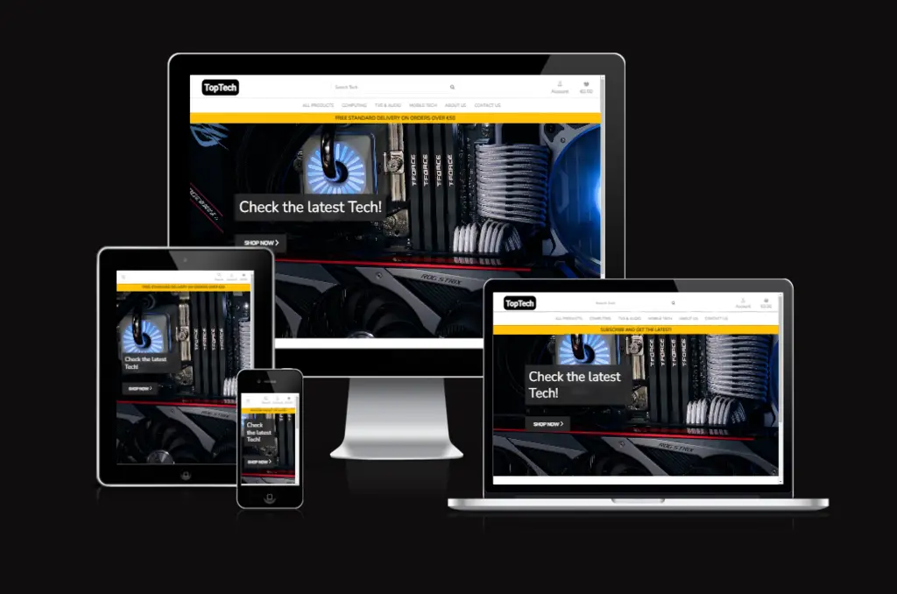

# **TopTech**

`To open the links in this document in a new browser tab please press CTRL + Mouse Click`

Welcome to TopTech, this is an e-commerce website where Customers will be able to purchase the latest tech available.

Customers will get opportunity to find any the latest Tech avaivlable in the market in just one place.

The TopTech website is for all types of audience from young to eldery and they can expect a website easy to navigate.

The main goal is to help the customer get the latest tech so that they are updated with latest technology available on the market at the best prices.



[**Live website**](https://toptech-244e7b312287.herokuapp.com/)

---

## **Content**

- [**TopTech**](#toptech)
  - [**Content**](#content)
  - [**User Experience**](#user-experience)
    - [**Visitors**](#visitors)
    - [**Goals**](#goals)
    - [**TopTech**](#toptech-1)
  - [**Agile**](#agile)
    - [**MoSCoW prioritization method**](#moscow-prioritization-method)
    - [**User Stories(Epics)**](#user-storiesepics)
      - [**Epic 1 - Basic Setup**](#epic-1---basic-setup)
      - [**Epic 2 - Products**](#epic-2---products)
      - [**Epic 3 - User authentication/management**](#epic-3---user-authenticationmanagement)
      - [**Epic 4 - Basket/checkout**](#epic-4---basketcheckout)
      - [**Epic 5 - Admin dashboard**](#epic-5---admin-dashboard)
      - [**Epic 6 - Product reviews**](#epic-6---product-reviews)
      - [**Epic 7 - Marketing and SEO (Search Engine Optimization)**](#epic-7---marketing-and-seo-search-engine-optimization)
      - [**Epic 8 - Readme documentation**](#epic-8---readme-documentation)
  - [**Design**](#design)
    - [**Typography**](#typography)
      - [**Fonts used**](#fonts-used)
      - [**Colours used**](#colours-used)
    - [**Wireframes**](#wireframes)
    - [**Entity Relationship Diagram (ERD)**](#entity-relationship-diagram-erd)
    - [**Features**](#features)
  - [**Technologies, libraries, programs and tools used**](#technologies-libraries-programs-and-tools-used)
  - [**Languages**](#languages)
    - [**HTML**](#html)
    - [**CSS**](#css)
    - [**JavaScript**](#javascript)
    - [**Python**](#python)
  - [**Accessibility**](#accessibility)
    - [**Wave**](#wave)
    - [**Lighthouse**](#lighthouse)
  - [**Testing**](#testing)
  - [**Bugs**](#bugs)
  - [**Deployment**](#deployment)
    - [**Fork the repository**](#fork-the-repository)
    - [**Clone the repository**](#clone-the-repository)
    - [**ElephantSQL**](#elephantsql)
    - [**Heroku deployment**](#heroku-deployment)
  - [**Credits**](#credits)
  - [**Acknowledgments**](#acknowledgments)

---

## **User Experience**

### **Visitors**

- Users will experience a website easy to navigate and full of Tech.
- Users will find a friendly support from our staff that are ready to guide and help with any enquire
- The content of the website is carefully supervised to make sure the Users get all the details of wanted products.
- 

### **Goals**

- The main goal is to offer the customers the latest Tech at the best prices possible
- To fully satisfy the customers with their needs.
- To get the TopTech website known so it captivates more happy customers
- Also to feel welcomed in our store 

### **TopTech**

- The website is presented with a Home page that has a motherboard and its components has a background image and a button to take the customer to start shop the products, at the top of the page is the navbar with its links and at the bottom is the footer.
- The navbar has the following options available 
  - **TopTech logo** - Available on large and extra large and when it pressed it takes you back to the home page
  - **Search bar** - Available on every page and device the search bar can be used to search a especific product
  - **Home** - Available on extra small, small and medium screens and when it pressed it takes you back to the home page
  - **About Us** - When clicked it will take you to the about page where you will find a page presented with a photo, toptech information, contact details and openning times
  - **Contact Us** - When clicked it will take you to the conatct page where you will be able to contact the TopTech team for any matter
  - **Account (if logged out)** - When clicked it will dropdown a menu with the following
    - **Sign Up** - When clicked it will take you to the sign up page where you can register
    - **Sign In** - When clicked it will take you to the sign in page where you can login to your account
  - **Account (if logged in)** - When clicked it will dropdown a menu with the following
    - **Profile** - When clicked it will take you to the sign up page where you can register
    - **Purchases** - When clicked it will take you to the purchases page where you will be able to see all your purchases if you made any
    - **Logout** - When clicked it will take you to the logout page where you will be able to logout from your account
  - **Account (if logged in and is the Admin)** - When clicked it will dropdown a menu with the following
    - **Admin page** - When clicked it will take you to the Admin page where you will be able to manage the website
    - **Product management** - When clicked it will take you to the Add product page so you can add more products
    - **About management** - When clicked it will take you to the Edit about so admin/owner can update the company details
    - **Profile** - When clicked it will take you to the sign up page where you can register
    - **Purchases** - When clicked it will take you to the purchases page where you will be able to see all your purchases if you made any
    - **Logout** - When clicked it will take you to the logout page where you will be able to logout from your account
  - **Basket** - When clicked it will take you to the basket and see your basket if you have anything in it
- Once in the Profile:
  - The user will be able to update the account details.
- Once in the products page you will be able to:
  - Sort products by price
  - Sort products by rating
  - And sort products by name
- If the User is checking a expecific product:
  - You will be able to read the reviews about it
  - You will be able to leave a review to the product

[**Back to the top**](#toptech "back_to_the_top")

---

## **Agile**

I have develop this project using Agile methodology

### **MoSCoW prioritization method**

- The MoSCoW prioritization method was utilized for the project in order to achieve the goals.
- The MoSCoW categories:
  - Must-Have - They are guaranteed to be delivered as they are critical in order to success.
  - Should-Have - They do complement the project by adding value but vital for it to run, so they can be added in future.
  - Could-Have - If not implemented it will not affect the functionality, but could improve User/Customer experience.
  - Won't-Have - It is not a priority for this iteration.
  - For more info on MoSCoW method please click [here](https://monday.com/blog/project-management/moscow-prioritization-method/)
- I have created a Kanban using Github projects, the User story template and labels were created following [Code Institute](https://learn.codeinstitute.net/courses/course-v1:CodeInstitute+AG101+2021_T1/courseware/a4e548ca70a3473aa890ba2ab9bf612c/db69a5829de8467eb071e63bde630a2e/?child=last) and where in each user story I have added acceptance criteria and tasks that needed to be completed in order to close them. The Kanban can be found [here](https://github.com/users/b1ndark/projects/6/views/1).

  
  [Kanban link image](x)

### **User Stories(Epics)**

#### **Epic 1 - Basic Setup**

- As a Developer I can create a new project so that I can start developing the project
- As a Developer I can setup the new project so that so that the project has its main structure/tools
- As a Developer I can setup all databases so that all the data is stored and protected
- As a Developer I can deploy before starting the project so that I can make sure that is all running before getting too deep in the development and having problems with deploying later and also to test it while developing

#### **Epic 2 - Products**

- As an User I can filter the products so that only displays the selected product category
- As an Admin I can add a new product so that Users are able to buy
- As an User I can view a single product so that I can view more detailed information and specifications
- As an User I can access all products section so that I can view every product from the store
- As an Admin I can edit a product so that the product info is updated
- As an Admin I can delete a product so that the customer does buy it if it doesn't exist
- As an User I can search so that I can find a specific product
- As an User I can go to the next or previous page so that I browse through an organized list of products

#### **Epic 3 - User authentication/management**

- As an User I can register an account so that access/view my profile/orders
- As an User I can Login so that I can view profile, update details and view orders history
- As an User I can logout so that my account is logged off
- As an User I can view my profile so that I can update any info and view orders
- As an User I can delete my account so that all my data is deleted

#### **Epic 4 - Basket/Checkout**

- As an User I can adjust the quantity of the product so that I purchase the right amount
- As an User I can view the basket so that I can view the total and checkout
- As an User I can remove a product form the basket that I don't need so that I don't purchase it
- As a developer I can add stripe to the website so that the users can safely use their cards to purchase the products
- As an User I can see a notification of my order so that I know that the payment was successful
- As an User I can receive and email confirming of my order so that I have a confirmation of the order ---------

#### **Epic 5 - Admin dashboard**

- As an Admin I can access to the website dashboard so that I can manage the website
- As an Admin I can add products from the website dashboard so that the users have more offers to buy
- As an Admin I can update the product details so that the user sees it with correct details/info
- As an Admin I can delete a product from the website so that the user doesn't buy it if no longer available

#### **Epic 6 - Product Reviews**

- As an User I can share my experience with the product so that other users know about it
- As an User I can see other users reviews of the product that I am looking to buy so that I know about experiences that users had with the product
- As an User I can edit my review so that the users can read the updated review
- As an User I can delete the review that I left in the product so that the product no longer has my review

#### **Epic 7 - Marketing and SEO (Search Engine Optimization)**

- As an User I can contact the website so that I get the right support
- As an User I can see the privacy policy so that I am aware of the website policy
- As an Admin/Owner I can improve the website SEO so that the website gets ranked higher to attract customers

#### **Epic 8 - Readme Documentation**

- Document all tests
- Readme Completion

[**Back to the top**](#toptech "back_to_the_top")

---

## **Design**

### **Typography**

#### **Fonts used**

From [Google Fonts](https://fonts.google.com/ "google_fonts"):

- [**Roboto**](https://fonts.google.com/specimen/Roboto?query=roboto) - font-family: 'Nunito', sans-serif;
- [**Nunito**](https://fonts.google.com/specimen/Nunito?query=nunito) - font-family: 'Roboto', sans-serif;

#### **Colours used**

The colours choosen for this project were neutral colours, mainly white as it is focused in a friendly enviroment and to atract any customer to the website, the colours are the following:
- Black colour: #000000
- White colour: #ffffff
- Red colour: #AA0000
- Gray colour: #808080
- Yellow colour: #FFFF00
- --blue: rgba(14, 91, 235, 0.795);
- --placeholder-color: #aab7c4; - Used for placeholder
- --background: #2c2b2ce3; - Used for background
- --background-hover: #1f1e1f; - Used for background when hover
- --text-color: rgba(0, 0, 0, .5); - Used for text colour
- --text-color-hover: rgba(0, 0, 0, .7); - Used for text when hover
- --background-2: rgb(221, 222, 226); - Used as a box-shadow colour for the custom checkbox 
- --border: 2px solid #000000; - Used for the borders
- --boxshadow: 0 0 8px 0.1rem rgba(14, 91, 235, 0.795); - Box shadow
- --product_boxshadow: 0 0 10px 0.1rem rgba(29, 30, 31, 0.795); - Used for the product box-shadow
- --btn-boxshadow: 0 0 6px 0.1rem rgba(75, 77, 78, 0.795); - Used as button box-shadow


[**Back to the top**](#toptech "back_to_the_top")

---

### **Wireframes**

- Wireframes created for both mobiles and desktops
  
  - **Home page**

    

  - **Contact page**

    

  - **Signup page**

    

  - **Signin page**

    

  - **Logout page**

    

  - **Profile page**

    

  - **Edit profile page**

    

  - **Delete account page**

    

  - **Forum page**

    

  - **Forum detail page**

    

  - **Add post page**

    

  - **Edit post page**

    

  - **Delete post page**

    

  - **Edit comment page**

    

  - **Delete comment page**

    

  - **403 Error page**

    

  - **404 Error page**

    

  - **500 Error page**

    

[**Back to the top**](#toptech "back_to_the_top")

---

### **Entity Relationship Diagram (ERD)**

Entity Relationship Diagram (ERD) was used to help understand the relationships between the models.

- x
- x
- x
- x
- x
- x

    

    [Image link](x)

[**Back to the top**](#toptech "back_to_the_top")

---

### **Features**

- #### Nav Bar

  - x
  - x

    - x
    - x
    - x
    - x
      - x
      - x
    - x
      - x
      - x
    - x
      - x

    - **Desktop navbar**
    - The navbar displays all the menus for the user to navigate.
    - Within the forum also has search bar.

    

    - **Small Screens navbar**
    - When using devices with small screens the navbar adapts, by putting all the navbar menus into to the dropdown button.
    - x

    

- #### Footer

  - x
  - x

    

- #### Home Page

  - x
  - x
  - x

    

- #### Contact Page

  - x
  - x

    
    

  - x

    

- #### Sign Up Page

  - x
  - x

    
    

- #### Sign In Page

  - x
  - x
  - x

    
    

- #### Log Out Page

  - x
  - x

    
    

- #### Profile Page

  - x
  - x
  - x
  - x
  - x

    

- #### Edit profile Page

  - x
  - x

    
    

- #### Delete profile Page

  - x
  - x

    
    

- #### Forum Page

  - x
  - x
  - x
  - x
  - x
  - x

    
    

- #### Post Detail Page

  - x
  - x
  - x
  - x

    

- #### Add post page

  - x
  - x
  - x
  - x

    
    

- #### Edit Post Page

  - x
  - x
  - x

    
    

- #### Delete Post Page

  - x
  - x

    
    

- #### Add Comment

  - x
  - x
  - x

    
    

- #### Edit Comment Page

  - x
  - x

    
    

- #### Delete Comment Page

  - x
  - x

    
    

- #### 403 Error Page

  - x
  - x

    

- #### 404 Error Page

  - x
  - x

    

- #### 500 Error Page

  - x
  - x

    

- #### Admin Page

  - x
    - x
    - x
    - x
    - x

    

[**Back to the top**](#toptech "back_to_the_top")

---

## **Technologies, libraries, programs and tools used**

- [HTML5](https://en.wikipedia.org/wiki/HTML5) - Used to create the templates for the website.
- [CSS](https://en.wikipedia.org/wiki/CSS) - Used to customize the website style.
- [Javascript](https://en.wikipedia.org/wiki/JavaScript) - Used to setup the settimeout for notifications and emailJS functionality in contact page.
- [Python](https://en.wikipedia.org/wiki/Python_(programming_language)) - Python language used in Django.
- [Django](https://en.wikipedia.org/wiki/Django_(web_framework)) - Django which is Python-based web framework used to develop the forum.
- [Bootstrap](https://getbootstrap.com/docs/5.3/getting-started/introduction/) - This toolkit was used to help build the website faster.
- [Codeanywhere](https://app.codeanywhere.com/) - Used to create the project.
- [Github](https://github.com/) - Where the website is stored.
- [Spell Check](https://chrome.google.com/webstore/detail/webpage-spell-check/mgdhaoimpabdhmacaclbbjddhngchjik/related) - Used to check spelling.
- [Gyazo](https://gyazo.com/) - Used to take Screenshots.
- [Cloud Convert](https://cloudconvert.com/) - Used to resize and convert screenshots.
- [W3C HTML](https://validator.w3.org/#validate_by_input) - Used to check for HTML code errors.
- [W3C CSS](https://jigsaw.w3.org/css-validator/) - Used to check for CSS code errors.
- [JSHint](https://jshint.com/) - Used to check for JavaScript code errors.
- [CI Python Linter](https://pep8ci.herokuapp.com/) - Used to check for Python code errors.
- [WAVE](https://wave.webaim.org/) - Used to help improving accessibility to individuals with disabilities, by showing where there might be errors.
- [Heroku](https://dashboard.heroku.com/apps) - Used to deploy the TopTech forum website.
- [Code Institute Template](https://github.com/Code-Institute-Org/ci-full-template) - Used to create project template.
- [ElephantSQL](https://www.elephantsql.com/) - PostgreSQL database used to store the data.
- [AWS](https://aws.amazon.com/) - Used to store image.
- [Font Awesome](https://fontawesome.com/) - Used to display icons.
- [Favicon](https://favicon.io/) - Used to create the website favicon.
- [Am I Responsive?](https://ui.dev/amiresponsive) - Used to display the website on different devices.
- [Google Fonts](https://fonts.google.com/) - Used for the fonts in the website.
- [Uizard](https://uizard.io/) - Used to create the website wireframes.
- [Lucidchart](https://lucid.app/) - Used to create the Entity Relationship Diagram (ERD)
- [Microsoft Word](https://www.microsoft.com/en-gb/microsoft-365/p/word/cfq7ttc0hlkm?activetab=pivot:overviewtab) - Used to write some texts to apply in the project.
- [ColorKit](https://colorkit.co/) - Used to create the colour palette.

[**Back to the top**](#toptech "back_to_the_top")

---

## **Languages**

### **HTML**

- **HTML code x with no errors when checked on W3C Markup Validation Service**

  - Home page results - x

  

  - Contact page results - x

  

  - Signin page results - x

  

  - Signup page results - x

  

  - Logout page results - x

  

  - Profile page results - x

  

  - Edit profile page results - x

  

  - Delete profile page results - x

  

  - Forum page results - x

  

  - Forum detail page results - x

  

  - Add post page results - x

  

  - Edit post page results - x

  

  - Delete post page results - x

  

  - Edit comment page results - x

  

  - Delete comment page results - x

  

  - 403 Error page results - x

  

  - 404 Error page results - x

  

  - 500 Error page results - x

  

### **CSS**

- **CSS code x with no errors when checked on W3C CSS Validation Service**

  - style.css file - x

  

### **JavaScript**

- **JavaScript code x with no errors when checked on JSHint**

  - Script.js file - x

  

### **Python**

- **Python code x with no errors when checked on CI Python Linter(forum)**

  - page - x

  

- **Python code x with no errors when checked on CI Python Linter(x)**

  - typerforum_views.py - x

  

  - typerforum_urls.py - x

  

  - typerforum_models.py - x

  

  - typerforum_forms.py - x

  

  - typerforum_admin.py - x

  

- **Python code x with no errors when checked on CI Python Linter(x)**

  - profile_views.py - x

  

  - profile_urls.py - x

  

  - profile_models.py - x

  

  - profile_forms.py - x

  

  - profile_admin.py - x

  

- **Python code x with no errors when checked on CI Python Linter(x)**

  - contact_views - x

  

  - contact_urls.py - x

  

  - contact_models.py - x

  

  - contact_forms.py - x

  

  - contact_admin.py - x

  

[**Back to the top**](#toptech "back_to_the_top")

---

## **Accessibility**

### **Wave**

- I have focused on making sure that the website forum is accessible:

  - x
  - x
  - x
  - x
  - x
  - x

    - Home page results

    

    - Contact page results

    

    - Signin page results

    

    - Signup page results

    

    - Logout page results

    

    - Profile page results

    

    - Edit profile page results

    

    - Delete profile page results

    

    - Forum page results

    

    - Forum detail page results

    

    - Add post page results

    

    - Edit post page results

    

    - Delete post page results

    

    - Edit comment page results

    

    - Delete comment page results

    

[**Back to the top**](#toptech "back_to_the_top")

---

### **Lighthouse**

- I can confirm that Lighthouse performed really good

  - Home page results

  

  - Contact page results

  

  - Signin page results

  

  - Signup page results

  

  - Logout page results

  

  - Profile page results

  

  - Edit profile page results

  

  - Delete profile page results

  

  - Forum page results

  

  - Forum detail page results

  

  - Add post page results

  

  - Edit post page results

  

  - Delete post page results

  

  - Edit comment page results

  

  - Delete comment page results

  

[**Back to the top**](#toptech "back_to_the_top")

---

## **Testing**

- The TopTech website has been tested and it works on different types of computers with different browsers:
  - Chrome
  - Safari
  - Microsoft Edge
  - Firefox

- It has been tested and work on different mobile phone brands:
  - Poco F5
  - Poco F5 Pro
  - Realme x2
  - Hauwei p30 lite
  - Iphone 11 Pro
  - Iphone 12 Pro
  - Xiaomi note 8

- Various tests that were carried out by myself, friends and family, using a variety of devices from desktops with different specs , lattops, tables to mobile phones.
- Also tested in different operating systems such as macOS, IOS, Windows and Android.

[**Back to the top**](#toptech "back_to_the_top")

---

- ### **Navbar**

| Feature | Expected Outcome | Testing | Result | Pass or Fail |
| ------- | ---------------- | ------- | ------ | ------------ |
| x | x | x | x | pass |
| x | x | x | x | pass |
| x | x | x | x | pass |
| x | x | x | x | pass |
| x | x | x | x | pass |

[**Back to the top**](#toptech "back_to_the_top")

---

## **Bugs**

- I found a bug when displaing the info in the footer, If I was in the about page, the info in footer would display with no issues but not in the other pages the info would be blank.

  - I had to create a contexts.py in about app, move the follow code from views.py to the contexts.py

  ```ruby
    from .models import About

    def about_contents(request):
        """
        To render the about info in every page footer
        """

        about = About.objects.first()

        context = {
            'about': about,
        }

        return context
  ```

  - and also had to add the following to the list of context processors in the templates variable in settings.py in order to render the context in every page footer.

  ```ruby
    'about.contexts.about_contents',
  ```

- After setting up send emails, when trying to signup I was getting a server timeout error ```SMTP.starttls() got an unexpected keyword argument 'keyfile'```, to fix this I did the following

  - I had to create a file named ```runtime.txt``` with ```python-3.9.16``` in it
  - After doing that I was getting another error but this time was when trying to deploy to Heroku which was failing. To fix it I had to downgrade the urllib3 from ```==2.0.7``` to ```==1.26.15```

- The navbar had a bug, the issue was when clicking on one of the menus to dropdown the choices, it would only show the choices when clicked a second time.

  - After researching about it I found that the issue was being caused by having a duplicate bootstrap.min.js file script as it was being called twice. So to fix it I deleted one of the scripts and now works fine.

[**Back to the top**](#toptech "back_to_the_top")

---

## **Deployment**

### **Fork the repository**

1. Open Github.

2. Log in or sign up.
3. Look for my repository [TopTech](https://github.com/b1ndark/project5).
4. Last on the right corner you will find the fork button(click on it).

### **Clone the repository**

1. Open **[Github](https://github.com/)**
2. Log in or Sign up
3. Look for my repository [TopTech](https://github.com/b1ndark/project5)
4. Look for code button next to the Gitpod button at the top right(click on it).
5. A window will pop up with options for you to select to clone it with such as HTTPS, SSH or GitHub CLI.
6. Once selected copy the link that is shown.
7. Open your code editor terminal.
8. Type `git clone` in the terminal and paste the copied repository link.
9. After all that just Press enter to create the clone.
10. Once the workspace(x) is opened type the following command to install all the required packages to ruin the app

    - Type the command ```pip install -r requirements.txt```

11. Within the settings make sure to set ```DEBUG = True```
12. Before deploying it, when all the modifications done make sure to set ```DEBUG = False```, because if left True it might expose vulnerabilities, so to minimize the security risk set it to 'False'
13. After setting it to False commit your changes by adding the following
    - Type the command ```git add .```
    - Type the command ```git commit -m "commit message"```
    - At last type the command ```git push```

### **ElephantSQL**

1. First go to **[ElephantSQL website](https://www.elephantsql.com/)**
2. If you already have an account login if not create an account.
3. Once logged in please click "+ Create New Instance" on the top right hand corner.
4. Add a name and the plan select "Tiny Turtle(Free)". Press Select Region.
5. Select your Region and click "Review".
6. Review all details and you are happy with it click "Create Instance".
7. Once the instance is created you will be redirected to the instance dashboard.
8. Go to details and copy the instance URL.
9. Within your workspace if you haven't got and "env.py" file create one.
10. In your "env.py" type the Following
    - type ```import os```
    - type ```os.environ["DATABASE_URL"]="<copied URL from elephantSQL>"```
11. Now go to your settings.py file and add the following
    - type

        ```ruby
        if os.path.isfile('env.py'):
            import env
        ```

    - then type

        ```ruby
        # DATABASES = {
        #     'default': {
        #         'ENGINE': 'django.db.backends.sqlite3',
        #         'NAME': BASE_DIR / 'db.sqlite3',
        #     }
        # }
            
        DATABASES = {
            'default': dj_database_url.parse(os.environ.get("DATABASE_URL"))
        }
        ```

12. Now after setting it all up, you have to run migrations so in your terminal type
    - First type
        ```python3 manage.py makemigrations```

    - Then type
        ```python3 manage.py migrate```

13. Now to confirm go back to your elephantSQL instance dashboard and on the left select "BROWSER".
14. Click "Table queries" and you will be able to see your database structure.
15. Last make sure to commit so it's all saved.

### **AWS S3 bucket setup**

1. Go to **[AWS Amazon](https://aws.amazon.com/)**.

2. Sign in or Sign up if you haven't got an account.
3. You will see the dashboard once you logged in.
4. At the top search for S3 buckets
5. As you get to the S3 buckets dashboard on the right click on Create bucket
6. **AWS Region** choose the closest to you
7. **Bucket name** try to give the same as your app
8. **Object Ownership** choose ACLs enable
9. At the **Block Public Access settings for this bucket**, Uncheck block all public access, the rest of the options leave as they are and press **Create bucket**
10. Now on the S3 buckets dashboard click on the bucket you just created
11. On the **Properties** tab, scroll down to **Static website hosting** and click **Edit**
12. Within the **Static website hosting** select **Enable** and the index document and Error document just use the default values "index.html" and "error.html", and then click **Save**
13. Now **Permissions** scroll down to **Cross-origin resource sharing (CORS)** and click **Edit**
14. Add the following code and click **Save Changes**
    ```ruby
    [
        {
            "AllowedHeaders": [
                "Authorization"
            ],
            "AllowedMethods": [
                "GET"
            ],
            "AllowedOrigins": [
                "*"
            ],
            "ExposeHeaders": []
        }
    ]
    ```
15. Next go to **Bucket Policy** and on the right click on **Policy generator**
16. In the **Select Policy Type** select **S3 Bucket Policy**
17. In the **Pricipal** type "*"
18. In the **Actions** select **GetObject**
19. Now in the other tab within the **Bucket Policy** copy the ARN ```arn:aws:s3:::bucket-name```, go back to the **Policy generator** tab and past the ARN in to the **Amazon Resource Name (ARN)**
20. Click **Add Statement** and then click in **Generate Policy** and copy the generated policy in to the **Bucket Policy Editor**, before you save it add a "/*" on to the end of the resource key, then save
21. Now within the **Permissions** tab go to **Access Control List** and click **Edit**
22. Within the **Everyone (public access)** enable **List**, accept the warning box and click **Save changes**
23. Now at the top seacrh for IAM (Identify and Access Management) and click on it
24. Once in the IAM dashboard, on the left click on **User groups** then on the right click on **Create group**
25. At the **User group name** give it a name for example ```manage-app-name``` and at the bottom click **Create group**
26. Now on the left click in **Policies** and on the right click **Create policy**
27. On the right select the json tab, then click **Actions** and then **Import policy**
28. Search for **AmazonS3FullAccess** and import it, after that get the ARN from **Bucket Policy Editor** and past it in the "resource" within the Policy editor, show look like the one below
29. 
    ```ruby
    {
      "Version": "2012-10-17",
      "Statement": [
        {
          "Sid": "Statement1",
          "Effect": "Allow",
          "Action": [
            "s3:*",
            "s3-object-lambda:*"
          ],
          "Resource": [
              "arn:aws:s3:::bucket-name",
              "arn:aws:s3:::bucket-name/*"
          ]
        }
      ]
    }
    ```
30. Click **Review Policy**, give it a **Name** "appName-policy" and a **Description** "Access to S3 bucket for appName static files", click **Create policy**
31. Go back to **User groups** click on your app group "manage-appName", go to **Permissions** tab, on the right click **Add permissions** and click **Attach policies**, search for the policy that you just created, select it and click **Attach Policies**
32. On the left click on **Users** link, once is openned on your right click **Create user**, on the **User name** type a user name "appName-staticfiles-user" and click **Next**
33. Under **Set permissions** select **Add user to group**, select the group that your are adding to "manage-app-name" and click **Next** and **Create User**
34. Go back to Users menu and select the User you just created and on the right click on **Create access key**, Select the Option **Application running outside AWS** and click **Next**, the **Description ta value** leave it blank and click **Create access key**
35. Click **Download .csv file** as it contains the **Access key ID** and the **Secret access key** which you will need them to authenticate
36. Now back in your app you need to install both Boto3 ```pip3 install boto3``` and Django-storages ```pip3 install django-storages``` and make sure to freeze afterwards ```pip3 freeze > requirements.txt```
37. Now in setting add ```'django-storages',``` to the Installed apps, then still within the settings add the following
    ```ruby
    if 'USE_AWS' in os.environ:
    # Cache control
    AWS_S3_OBJECT_PARAMETERS = {
        'Expires': 'Thu, 31 Dec 2099 20:00:00 GMT',
        'CacheControl': 'max-age=94608000',
    }

    # Bucket Config
    AWS_STORAGE_BUCKET_NAME = 'your bucket name'
    AWS_S3_REGION_NAME = 'your account region'
    AWS_ACCESS_KEY_ID = os.environ.get('AWS_ACCESS_KEY_ID')
    AWS_SECRET_ACCESS_KEY = os.environ.get('AWS_SECRET_ACCESS_KEY')
    AWS_S3_CUSTOM_DOMAIN = f'{AWS_STORAGE_BUCKET_NAME}.s3.amazonaws.com'

    # Static and media files
    STATICFILES_STORAGE = 'custom_storages.StaticStorage'
    STATICFILES_LOCATION = 'static'
    DEFAULT_FILE_STORAGE = 'custom_storages.MediaStorage'
    MEDIAFILES_LOCATION = 'media'

    # Override static and media Urls in production
    STATIC_URL = f'https://{AWS_S3_CUSTOM_DOMAIN}/{STATICFILES_LOCATION}/'
    MEDIA_URL = f'https://{AWS_S3_CUSTOM_DOMAIN}/{MEDIAFILES_LOCATION}/'
    ```
38. In your app create a new file called "custom_storages.py" to tell django to use S3 to store static files when someone runs collectstatic and also to store any uploaded images, the custom_storages.py code is bellow
    ```ruby
    from django.conf import settings
    from storages.backends.s3boto3 import S3Boto3Storage


    class StaticStorage(S3Boto3Storage):
        location = settings.STATICFILES_LOCATION


    class MediaStorage(S3Boto3Storage):
        location = settings.MEDIAFILES_LOCATION

    ```

### **Stripe setup**

1. Go to [Stripe](https://stripe.com/gb)

2. Sign in or Sign up if you haven't got an account.
3. Once in the dashboard click in **Developers** on the top right corner
4. On the top click on **Webhooks**
5. If you haven't created an endpoint yet then, click on **Add endpoint**
6. At the Endpoint URL type ```https://appName.herokuapp.com/checkout/wh```
7. Select all events and click **Add endpoint**
8. Get the webhook secret key and add it to your **Heroku Config Vars**
8. Now run your app and test the transactions to check if everything is working, if it is working it will display the transactions in the webhooks tab

### **Heroku deployment**

1. Within your opened project in Codeanywhere or Gitpod you will have to freeze requirements.txt file

    - Type the command ```pip3 freeze > requirements.txt```

    

2. Go to your settings.py file and change DEBUG to "False".
3. Add the following to your settings.py file

   ```ruby
   ALLOWED_HOSTS = ['localhost', 'your-app-name.herokuapp.com']
   ```

4. Store all the sensible data such as for "SECRET_KEY" and "DATABASE_URL" into to the "env.py" file.
5. Double check if "env.py" file is in your ".gitignore" file so it is stopped from being uploaded.
6. Make sure you commit and push it.
7. Open and login to your Heroku account.
8. Once your dashboard opens, on the top right-hand corner click on New and then on the Create new app.
9. Give your app a name and select the location.
10. Once created, the app dashboard will open.
11. Select Settings tab.
12. Go down to Config Vars
    - add to Key "PORT" and to add value "8000"
    - add to key "DATABASE_URL" and to add value "your Postgres url"
    - add to key "SECRET_KEY" and to add value "your secret key"
    - add to key "AWS_ACCESS_KEY_ID" and to add value "your aws access key id"
    - add to key "AWS_SECRET_ACCESS_KEY" and to add value "your aws secret access key"
    - add to key "USE_AWS" and to add value "True"
    - add to key "STRIPE_PUBLIC_KEY" and to add value "Stripe public key"
    - add to key "STRIPE_SECRET_KEY" and to add value "Stripe secret key"
    - add to key "STRIPE_WH_SECRET" and to add value "Stripe webhook secret"
13. Next go to Buildpacks and add "heroku/python" and "heroku/nodejs"

    - Make sure they are in this order first "heroku/python" and then in second "heroku/nodejs"

14. After all that select Deploy tab.
15. Go down to Deployment method and select GitHub.
16. Connect to your GitHub and enter the repository.
17. Once is connected you can either have automatic or manual deployment.
18. Choose your preferred one by pressing deploy.
19. Once the app is successfully deployed click "View"

[Live project](https://toptech-244e7b312287.herokuapp.com/)

[**Back to the top**](#toptech "back_to_the_top")

---

## **Credits**

- ### **Content**

  - Various resources were used to help through out the project:

    - Code Institute Think before I blog tutorial was a good help through out the project, from setting up the project, building it to the deployment.
    - [Font-anwsome libraries](https://cdnjs.com/libraries/font-awesome)
    - [Bootstrap](https://getbootstrap.com/docs/5.3/getting-started/introduction/)
    - Django documentation [Django](https://docs.djangoproject.com/en/5.0/)
    - [Django Crispy forms](https://django-crispy-forms.readthedocs.io/en/latest/install.html)
    - [Basic setup and deployment](https://docs.google.com/document/d/1P5CWvS5cYalkQOLeQiijpSViDPogtKM7ZGyqK-yehhQ/edit#heading=h.5s9novsydyp1)
    - For the forum rules [Elm](https://discourse.elm-lang.org/faq)
    - To help out with active links [Stackoverfow](https://stackoverflow.com/questions/39639264/django-highlight-current-page-in-navbar)
    - For generic views [Django docs](https://docs.djangoproject.com/en/3.2/topics/class-based-views/generic-display/)
    - For Edit generic views [Django docs](https://docs.djangoproject.com/en/3.2/topics/class-based-views/generic-editing/)
    - Bootstrap [alerts](https://getbootstrap.com/docs/5.0/components/alerts/)
    - To display labels in kanban view [Github community](https://github.com/orgs/community/discussions/10788)
    - To help improving the User experience by being able to close the message box when clicked anywhere in the screen I have found the following link that have helped me understand and implement the logic [How to close the box by clicking anywhere](https://stackoverflow.com/questions/12086663/how-to-close-the-box-if-click-anywhere)
    - To create a link to the admin page from the website I found this topic on stackoverflow that have helped me setup the link [admin:index](https://stackoverflow.com/questions/1022236/linking-to-the-django-admin-site)

  - I have watched some tutorials on Youtube that have helped me understand and learn through out the project:

    - [x](x)
    - [x](x)
    - [x](x)
    - [x](x)

  - I have used the Readme structure from my fourth project as a template.

- ### **Media**

  - Websites Used
    - [Pexels](https://www.pexels.com/)
    - [Unsplash](https://unsplash.com/)

  - Photos and Authors where to find them:
    - [HP computer](https://unsplash.com/photos/black-computer-keyboard-beside-black-flat-screen-computer-monitor-1Ksz0Q1NU3k) - photo is from Dhru J
    - [MSI laptop](https://unsplash.com/photos/black-and-gray-laptop-computer-bBqMGSGaOXw) - photo is from Vadim Artyukhin
    - [Windows laptop](https://unsplash.com/photos/macbook-pro-on-white-couch-6WvZo5FOxww) - photo is from Bram Van Oost
    - [HP laptop](https://unsplash.com/photos/a-laptop-on-a-desk-OKKV_hqEtFU) - photo is from Mika Baumeister
    - [HP white laptop](https://unsplash.com/photos/a-white-rectangular-device-on-a-wooden-surface-qmcTZZ7XhqY) - photo is from ANdrey Matveev
    - [Strix GTX1080 Ti](https://unsplash.com/photos/lighted-black-and-gray-graphics-card-zPHftoPajis) - photo is from Daniel Hatcher
    - [Alienware computer](https://unsplash.com/photos/black-flat-screen-computer-monitor-beside-white-computer-keyboard-Hpaq-kBcYHk) - photo is from Alienware
    - [Alienware computer 2](https://unsplash.com/photos/black-flat-screen-computer-monitor-Bp3KmTZQlfw) - photo is from Alienware
    - [Iphone 15](https://unsplash.com/photos/a-black-and-a-gold-oneplug-phone-on-a-black-surface-opAeFlgyQqs) - photo is from Mockup Free
    - [Iphone X](https://unsplash.com/photos/silver-iphone-x-floating-over-open-palm-6wdRuK7bVTE) - photo is from Neil Soni
    - [Samsung S21+](https://unsplash.com/photos/black-and-white-amazon-gift-card-yqcloMb3Abw) - photo is from Anh Nhat
    - [Samsung Galaxy Fold](https://unsplash.com/photos/person-holding-black-phone-vI8_06RmSC0) - photo is from Mika Baumeister
    - [Samsung Galaxy Z Flip](https://unsplash.com/photos/person-holding-white-android-smartphone-PdfqLVSk-kg) - photo is from Daniel Romero
    - [Samsung S21 Ultra](https://unsplash.com/photos/black-sony-remote-control-beside-white-tissue-paper-uCqMa_s-JDg) - photo is from Anh Nhat
    - [Sony Xperia](https://unsplash.com/photos/a-close-up-of-the-back-of-a-black-sony-phone-rSGjpajBLNU) - photo is from He Junhui
    - [Sony Xperia Z5](https://unsplash.com/photos/black-sony-xperia-h4x-Z7704Bg) - photo is from Alex Amva
    - [Dell laptop](https://unsplash.com/photos/silver-laptop-on-brown-wooden-table-e59Y6vqbL7Y) - photo is from Dell
    - [Asus laptop](https://unsplash.com/photos/a-laptop-computer-sitting-on-top-of-a-wooden-desk-7uscPYY6fvQ) - photo is from Joachim Pressl
    - [Asus Zenbook Pro Duo](https://unsplash.com/photos/black-laptop-computer-on-brown-wooden-table-60x59t9fA-o) - photo is from Onur Binay
    - [Dell laptop 2](https://unsplash.com/photos/person-using-black-laptop-computer-on-brown-wooden-table-8pb7Hq539Zw) - photo is from Dell
    - [Acer laptop white](https://unsplash.com/photos/white-acer-chromebook-laptop-rndjGfyInvs) - photo is from Andrew Neel
    - [Samsung laptop](https://unsplash.com/photos/two-woman-using-laptop-Uduc5hJX2Ew) - photo is from Brooke Cagle
    - [iMac](https://unsplash.com/photos/silver-imac-with-apple-magic-keyboard-on-white-sufrace-3xQ65cknLPk) - photo is from Quaritsch Photography
    - [M2 Macbook Pro](https://unsplash.com/photos/a-laptop-computer-sitting-on-top-of-a-white-desk-KIfQO1AQ2Ew) - photo is from Bram Van Oost
    - [M1 Macbook Pro](https://unsplash.com/photos/a-laptop-computer-sitting-on-top-of-a-wooden-table-difAvscQf7M) - phot is from Opollo Photography
    - [Asus Z790 Maximus Hero](https://unsplash.com/photos/a-close-up-of-a-book-with-a-red-logo-on-it-aqk9DahMxUw) - photo is from Gamercomp
    - [Asus laptop 2](https://unsplash.com/photos/a-laptop-computer-sitting-on-top-of-a-wooden-table-te2Bx91N16w) - photo is from Joachim Pressl
    - [ROG laptop](https://www.pexels.com/photo/asus-republic-of-gamers-logo-in-black-and-white-12877878/) - photo is from Kasra Askari
    - [Macbook Pro 2](https://www.pexels.com/photo/macbook-pro-turned-off-205421/) - photo is from Craig Dennis
    - [iMac silver](https://www.pexels.com/photo/silver-imac-on-white-table-5082554/) - photo is from Cottonbro Studio

  - The Favicon was created using - [Favicon Generator](https://favicon.io/favicon-generator/)
  - Socials networks used in the footer:
    - [Github](https://github.com/b1ndark)
    - [Linkedin](https://www.linkedin.com/in/vitor-de-oliveira-50076b268/)
    - [Twitter(X)](https://twitter.com/)
    - [Instagram](https://www.instagram.com/)
    - [Facebook](https://www.facebook.com/)
    - [Youtube](https://www.youtube.com/)

[**Back to the top**](#toptech "back_to_the_top")

---

## **Acknowledgments**

- I would like to thank my mentor [Graeme Taylor](https://github.com/G-Taylor) for helping me along the way in completing my Fifth milestone project, and through the entire course.
- I would like to thank Code Institute Tutors for helping me when I had issues along the project and the course.
- Also, I would like to thank family and friends for helping with testing The TopTech project and support along the way through the course

[**Back to the top**](#toptech "back_to_the_top")
