# **TopTech**

`To open the links in this document in a new browser tab please press CTRL + Mouse Click`

Welcome to TopTech, this is an e-commerce website (B2C) where Customers will be able to purchase the latest tech available.

Customers will get the opportunity to find the latest Tech available in the market in just one place.

The TopTech website is for all types of audience and they can expect a website that is easy to navigate.

The main goal is to help and make sure the customers get the latest tech so that they are not outdated and are updated with latest technology available on the market at the best prices.


[**Live website**](https://toptech-244e7b312287.herokuapp.com/ "TopTech website")

---

## **Content**

- [**TopTech**](#toptech)
  - [**Content**](#content)
  - [**User Experience**](#user-experience)
    - [**Visitors**](#visitors)
    - [**Goals**](#goals)
    - [**TopTech**](#toptech-1)
  - [**Agile**](#agile)
    - [**MoSCoW prioritization method**](#moscow-prioritization-method)
    - [**User Stories(Epics)**](#user-storiesepics)
      - [**Epic 1 - Basic Setup**](#epic-1---basic-setup)
      - [**Epic 2 - Products**](#epic-2---products)
      - [**Epic 3 - User authentication/management**](#epic-3---user-authenticationmanagement)
      - [**Epic 4 - Basket/checkout**](#epic-4---basketcheckout)
      - [**Epic 5 - Admin dashboard**](#epic-5---admin-dashboard)
      - [**Epic 6 - Product reviews**](#epic-6---product-reviews)
      - [**Epic 7 - Marketing and SEO (Search Engine Optimization)**](#epic-7---marketing-and-seo-search-engine-optimization)
      - [**Epic 8 - Readme documentation**](#epic-8---readme-documentation)
  - [**Design**](#design)
    - [**Typography**](#typography)
      - [**Fonts used**](#fonts-used)
      - [**Colours used**](#colours-used)
    - [**Wireframes**](#wireframes)
    - [**Entity Relationship Diagram (ERD)**](#entity-relationship-diagram-erd)
    - [**Features**](#features)
    - [**Future features**](#future-features)
  - [**Technologies, libraries, programs and tools used**](#technologies-libraries-programs-and-tools-used)
  - [**Languages**](#languages)
    - [**HTML**](#html)
    - [**CSS**](#css)
    - [**JavaScript**](#javascript)
    - [**Python**](#python)
  - [**Accessibility**](#accessibility)
    - [**Wave**](#wave)
    - [**Lighthouse**](#lighthouse)
  - [**Testing**](#testing)
  - [**Manual Tests**](#manual-tests)
  - [**Bugs**](#bugs)
  - [**SEO and Marketing**](#seo-search-engine-optimization-and-marketing)
  - [**Deployment**](#deployment)
    - [**Fork the repository**](#fork-the-repository)
    - [**Clone the repository**](#clone-the-repository)
    - [**ElephantSQL**](#elephantsql)
    - [**AWS S3 bucket**](#aws-s3-bucket-setup)
    - [**Heroku deployment**](#heroku-deployment)
  - [**Credits**](#credits)
  - [**Acknowledgments**](#acknowledgments)

---

## **User Experience**

### **Visitors**

- Users will experience a website that is easy to navigate and that it contains a variety of Tech.
- Users will find a friendly support from our staff that are ready to guide and help with any enquires.
- The content of the website is carefully supervised to make sure the Users get all the details of wanted products.

### **Goals**

- The main goal is to offer the customers the latest Tech at the best prices possible.
- To fully satisfy the customers with their needs.
- To get the TopTech website known so it captivates more happy customers.
- Also to feel welcomed in our store.

### **TopTech**

- The website is presented with a Home page that has a motherboard and its components has a background image and a button to take the customer to the products to start shopping, at the top of the page is the navbar with its links and at the bottom is the footer.
- The navbar has the following options available 
  - **TopTech logo** - Available on large and extra-large and when it pressed it takes you back to the home page
  - **Search bar** - Available on every page and device the search bar can be used to search a specific product
  - **Home** - Available on extra small, small and medium screens and when it pressed it takes you back to the home page
  - **About Us** - When clicked it will take you to the about page where you will find a page presented with a photo, TopTech information, contact details and opening times
  - **Contact Us** - When clicked it will take you to the contact page where you will be able to contact the TopTech team for any support or matter
  - **Account (if logged out)** - When clicked it will dropdown a menu with the following
    - **Sign Up** - When clicked it will take you to the sign up page where you can register
    - **Sign In** - When clicked it will take you to the sign in page where you can login to your account
  - **Account (if logged in)** - When clicked it will dropdown a menu with the following
    - **Profile** - When clicked it will take you to the sign up page where you can register
    - **Purchases** - When clicked it will take you to the purchases page where you will be able to see all your purchases if you made any
    - **Logout** - When clicked it will take you to the logout page where you will be able to logout from your account
  - **Account (if logged as Admin)** - When clicked it will dropdown a menu with the following
    - **Admin page** - When clicked it will take you to the Admin page where you will be able to manage the website
    - **Product management** - When clicked it will take you to the Add product page so you can add more products to the inventory
    - **About management** - When clicked it will take you to the Edit about page so admin/owner can update the company details
    - **Profile** - When clicked it will take you to the sign up page where you can register
    - **Purchases** - When clicked it will take you to the purchases page where you will be able to see all your purchases, if you made any
    - **Logout** - When clicked it will take you to the logout page where you will be able to logout from your account
  - **Basket** - When clicked it will take you to the basket and see your basket if you have anything in it
- Once in the Profile:
  - The user will be able to update the account details.
- Once in the products page you will be able to:
  - Sort products by price
  - Sort products by rating
  - And sort products by name
- If the User is checking a specific product:
  - You will be able to read the user reviews about the specific product
  - If you are logged in you will be able to leave a review to the product

[**Back to the top**](#toptech "back_to_the_top")

---

## **Agile**

I have developed this project using Agile methodology

### **MoSCoW prioritization method**

- The MoSCoW prioritization method was utilized for the project in order to achieve the goals.
- The MoSCoW categories:
  - Must-Have - They are guaranteed to be delivered as they are critical in order to success.
  - Should-Have - They do complement the project by adding value but vital for it to run, so they can be added in future.
  - Could-Have - If not implemented it will not affect the functionality, but could improve User/Customer experience.
  - Won't-Have - It is not a priority for this iteration.
  - For more info on MoSCoW method please click [here](https://monday.com/blog/project-management/moscow-prioritization-method/)
- I have created a Kanban using Github projects, the User story template and labels were created following [Code Institute](https://learn.codeinstitute.net/courses/course-v1:CodeInstitute+AG101+2021_T1/courseware/a4e548ca70a3473aa890ba2ab9bf612c/db69a5829de8467eb071e63bde630a2e/?child=last) and in each user story I have added acceptance criteria and tasks that needed to be completed in order to close them. The Kanban can be found [here](https://github.com/users/b1ndark/projects/6/views/1).

  
  [Kanban link image](https://i.gyazo.com/ad00744508e5dec7faf37c4019607266.png)

### **User Stories(Epics)**

#### **Epic 1 - Basic Setup**

- As a Developer I can create a new project so that I can start developing the project.
- As a Developer I can setup the new project so that so that the project has its main structure/tools.
- As a Developer I can setup all databases so that all the data is stored and protected.
- As a Developer I can deploy before starting the project so that I can make sure that is all running before getting too deep in the development and having problems with deploying later and also to test it while developing.

#### **Epic 2 - Products**

- As a User I can filter the products so that only displays the selected product category.
- As an Admin I can add a new product so that Users are able to buy.
- As a User I can view a single product so that I can view more detailed information and specifications.
- As a User I can access all products section so that I can view every product from the store.
- As an Admin I can edit a product so that the product info is updated.
- As an Admin I can delete a product so that the customer does buy it if it doesn't exist.
- As a User I can search so that I can find a specific product.
- As a User I can go to the next or previous page so that I browse through an organized list of products.

#### **Epic 3 - User authentication/management**

- As a User I can register an account so that access/view my profile/orders.
- As a User I can Login so that I can view profile, update details and view orders history.
- As a User I can logout so that my account is logged off.
- As a User I can view my profile so that I can update any info and view orders.
- As a User I can delete my account so that all my data is deleted.

#### **Epic 4 - Basket/Checkout**

- As a User I can adjust the quantity of the product so that I purchase the right amount.
- As a User I can view the basket so that I can view the total and checkout.
- As a User I can remove a product form the basket that I don't need so that I don't purchase it.
- As a developer I can add stripe to the website so that the users can safely use their cards to purchase the products.
- As a User I can see a notification of my order so that I know that the payment was successful.
- As a User I can receive and email confirming of my order so that I have a confirmation of the order.

#### **Epic 5 - Admin dashboard**

- As an Admin I can access to the website dashboard so that I can manage the website.
- As an Admin I can add products from the website dashboard so that the users have more offers to buy.
- As an Admin I can update the product details so that the user sees it with correct details/info.
- As an Admin I can delete a product from the website so that the user doesn't buy it if no longer available.

#### **Epic 6 - Product Reviews**

- As a User I can share my experience with the product so that other users know about it.
- As a User I can see other users reviews of the product that I am looking to buy so that I know about experiences that users had with the product.
- As a User I can edit my review so that the users can read the updated review.
- As a User I can delete the review that I left in the product so that the product no longer has my review.

#### **Epic 7 - Marketing and SEO (Search Engine Optimization)**

- As a User I can contact the website so that I get the right support.
- As a User I can visit the About page so that I get to know more about the company such as history or opening times.
- As an Admin I can Edit/update the about page so that the company information is always updated for the Users.
- As a User I can subscribe so that I can get the latest offers.
- As a User I can see the privacy policy so that I am aware of the website policy.
- As an Admin/Owner I can improve the website SEO so that the website gets ranked higher to attract customers.

#### **Epic 8 - Readme Documentation**

- Document all tests.
- Readme Completion.

[**Back to the top**](#toptech "back_to_the_top")

---

## **Design**

### **Typography**

#### **Fonts used**

From [Google Fonts](https://fonts.google.com/ "google_fonts"):

- [**Roboto**](https://fonts.google.com/specimen/Roboto?query=roboto) - font-family: 'Nunito', sans-serif;
- [**Nunito**](https://fonts.google.com/specimen/Nunito?query=nunito) - font-family: 'Roboto', sans-serif;

#### **Colours used**

The colours chosen for this project were neutral colours, mainly white as it is User friendly and to attract any customer to the website, the colours are the following:
- Black colour: #000000
- White colour: #ffffff
- Red colour: #AA0000
- Gray colour: #808080
- Yellow colour: #ffc107
- --blue: rgba(14, 91, 235, 0.795);
- --placeholder-color: #aab7c4; - Used for placeholder
- --background: #2c2b2ce3; - Used for background
- --background-hover: #1f1e1f; - Used for background when hover
- --text-color: rgba(0, 0, 0, .5); - Used for text colour
- --text-color-hover: rgba(0, 0, 0, .7); - Used for text when hover
- --background-2: rgb(221, 222, 226); - Used as a box-shadow colour for the custom checkbox 
- --border: 2px solid #000000; - Used for the borders
- --boxshadow: 0 0 8px 0.1rem rgba(14, 91, 235, 0.795); - Box shadow
- --product_boxshadow: 0 0 10px 0.1rem rgba(29, 30, 31, 0.795); - Used for the product box-shadow
- --btn-boxshadow: 0 0 6px 0.1rem rgba(75, 77, 78, 0.795); - Used as button box-shadow


[**Back to the top**](#toptech "back_to_the_top")

---

### **Wireframes**

- Wireframes created for both desktops and mobiles
  
  - **Home page**

    

  - **Contact page**

    

  - **About page**

    

  - **Edit about page**

    

  - **Signup page**

    

  - **Signin page**

    

  - **Logout page**

    

  - **Profile page**

    

  - **Edit profile page**

    

  - **Delete account page**

    

  - **Products page**

    

  - **Product detail page**

    

  - **Add product page**

    

  - **Edit product page**

    

  - **Delete product page**

    

  - **Edit review page**

    

  - **Delete review page**

    

  - **Basket page**

    

  - **Checkout page**

    
  
  - **Checkout success page**

    

  - **Purchases page**

    

  - **404 Error page**

    

[**Back to the top**](#toptech "back_to_the_top")

---

### **Entity Relationship Diagram (ERD)**

Entity Relationship Diagram (ERD) was used to help understand the relationships between the models.
The tool used to help understand and create the diagram was [Lucid](https://lucid.app/)

- User and UserProfile have an OneToOne relationship, one User can only have one profile and a profile can only belong to one User.
- Product and reviews have a OneToMany relationship, one product can have none to many reviews but, a review can only belong to one product.
- User and reviews have OneToMany relationship, a User can have none to many reviews but, a review can only belong to one User.
- User and Orders have a OneToMany relationship, one User can have none to many orders but, an order can only belong to one User.
- Products and categories, one product can only have one category but, a category can have none to many products.
- Order and products have ManyToMany relationship, One Order has none to many products and many products can be in none to many orders.

    

    [Image link](https://i.gyazo.com/50fab83255df3ddc309775e3fd061541.png)

[**Back to the top**](#toptech "back_to_the_top")

---

### **Features**

- #### **Nav Bar**

  - The website navbar is presented at the top of the page and it is fixed so, it will follow the User as it scrolls down the pages, the reason for this is so the User doesn't have to scroll back up to access other menus.
  - Within the navbar the User will find the following buttons/links.

    - **Logo**, the website **logo** available on large and extra-large screens which is presented on the left of the page and once pressed it will take you back to home page.
    - **Search bar**, in the middle of the navbar you find the **search bar** which you can use to look for any particular product.
    - **Account**, on the right of the navbar is the **Account** menu which contains the following.
      - If the User isn't logged in
        - **Register** button which when pressed it will take you to the **Signup** page.
        - **Login** button which when pressed it will take you to the **Login** page.

          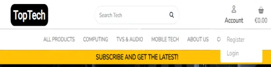

      - If the User is logged in
        - **Profile** button which when pressed it will take you to the profile page where you will be able to edit and delete account.
        - **Purchases** button when pressed it will take you to the purchase's history page.
        - **Logout** button when pressed it will take you to the logout page.

          

      - If logged in as Admin
        - **Admin page** button which when pressed it will take you to the admin page where you will be able to manage the website.
        - **Product Management** button which when pressed it will take you to the add product page.
        - **About Management** button which when pressed it will take you to the Edit About page.
        - **Profile** button which when pressed it will take you to the profile page where you will be able to edit and delete account.
        - **Purchases** button when pressed it will take you to the purchase's history page.
        - **Logout** button when pressed it will take you to the logout page.

          

    - **Basket** is next to the **Account** menu, the basket it will display the total of your basket if you added products to it and when pressed it will take you to the basket page.

      

    - **All products** which when clicked it will drop the following menu.
      - **By Price** When clicked it will display all products by the price.
      - **By Rating** When clicked it will display all products by the rating.
      - **By Category** When clicked it will display all products by the Category. 
      - **All Products** When clicked it will display all products.

        

    - **Computing** Which when clicked it will drop the following menu.
      - **Laptops** When pressed it displays all Laptops available in stock.
      - **Desktops** When pressed it displays all Desktops available in stock.
      - **Gaming Computers** When pressed it displays all Gaming Computers available in stock.
      - **All Computers** When pressed it will display all types of computers available in stock.

        
      
    - **TVs & Audio** Which when clicked it will drop the following menu.
      - **TVs** When pressed it will display all TVs available in stock.
      - **Home cinema** When pressed it will display all home cinemas available in stock.
      - **Headphones** When pressed it will display all Headphones available in stock.
      - **Radios** When pressed it will display all Radios available in stock.
      - **All TVs & Audio** When pressed it will display all TVs & Audio available in stock.

        
      
    - **Mobile Tech** Which when pressed it will display the following.
      - **Mobile phones** When pressed it will display all Mobile phones available in stock.
      - **Tablets** When pressed it will display all Tablets available in stock.
      - **All Mobile Tech** When pressed it will display all Mobile Tech available in stock.

        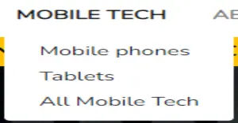

    - **Large screens navbar**
      - The navbar displays all the menus for the user to navigate.

        

    - **Small screens navbar**
      - When using devices with small screens the navbar adapts, by putting all the navbar product menus into to the dropdown button.

        

      - Dropdown menu button when clicked (Contains the **Home** button which will take you back to the Home page).

        

      - Search button when clicked drops a search bar

        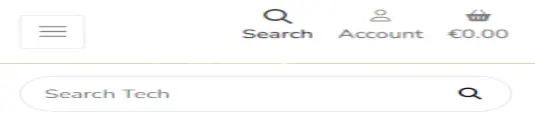

- #### **Notifications**

  - Notifications window display messages to the User, also display products that you add to the basket.
  - To close the messages window, you can either close it by clicking the cross or just click anywhere in the screen and the notification will close.

    - This is the notification window

      

    - This is the code used to show the notification and to close it by clicking anywhere in the screen, the code is stored in the base.html template.

      

- #### **Footer**

  - The footer has three sections which are the following.
    - **Contact Us** it displays the company contact details like phone number, address and email.
    - **Socials** is displays the social networks where the company is represented.
    - **Subscribe** the users will be able to subscribe to the TopTech newsletter to access the offers available.

      

- #### **Home Page**

  - The Users will be presented with a website that has a banner under the navbar and it displays messages running in carousel slide changing every four seconds, the banner is on every page.
  - The background image is of a ROG (Republic of Gamers) motherboard with its components.
  - Within the Background image there is a message and a button to take the User to the products page to start shopping.

    

- #### **Contact Page**

  - The User will be presented with a contact form in case the User wants to contact the TopTech support team regarding any matter.

    

  - If submitted the User will be presented with a notification stating that the form has been submitted.

    

  - The User will also get an email confirming that the request had been received by the TopTech support Team, within that email there will be a copy of the matter sent by the User.

    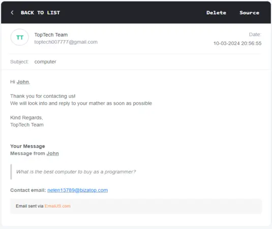

- #### **About Page**

  - The User is presented with a photo of the TopTech company and also info regarding the company history.
  - Location and opening times also displayed.

    

- #### **Edit About Page**

  - The Admin is presented with a form to Edit the Company details.

    

  - Also, a notification is displayed when About page is successfully updated.
    
    

- #### **Create About Page**

  - Only one About page is allowed, when you try to create another about page while there is already one in the database, you will get a notification error as the website is limited to have only one about, you will get the following notification

    

- #### **Sign Up Page**

  - In the Sign up page the User is presented with a signup form where User is asked for a username, email and password.
  - If the User has already an account there is a link provided to take the user to the Signin page.

    

  - If form is submitted the User will be presented with a page that asks the User to verify the registration by going to the email.

    

  - Also, the User will get a notification.

    

- #### Sign Up Confirmation

  - Within the email the User will be presented with the following email, if the User clicks the link provided is redirected to the website to confirm.
    
    
  
  - In order to confirm the registration, the User will have to click **Confirm** button to confirm the email provided.

    

  - Once confirmed a notification is displayed confirming it and you will be able to login.

    

- #### Sign In Page

  - User is presented with a login form so User can login, add product reviews and update profile.
  - If the User does not have an account there is a link that when clicked User is redirected to the Sign up page.
  
    
  
  - When logged in the User is redirected to the Home page with a notification displayed letting the User know that successfully logged in.

    

- #### Log Out Page

  - **Logout page** the User is presented with a question whether wants to logout or not.

    

  - If the User confirms logging out, will be redirected to the Home page and a notification will be displayed to confirm it.

    

- #### Profile Page

  - Within the navbar the profile is accessed by clicking in the **Account** dropdown menu, once the menu drops click Profile.
  - The Profile page will present the Users profile that will display a photo, biography and favourite brands, personal information and danger sections that are only seen/accessed by the owner of the profile.
  - Within the Danger section of the Profile the User has the following.
    - **Edit** which will take the User to the Edit profile page.
    - **Delete** which will take the User to the Delete account page.

    

- #### Edit Profile Page

  - **Edit profile** presents the User a form which User can use to update the profile if desired.

    

  - If User decides to Cancel, the user will be taken back to the profile.
  - If the User does update the profile, will be redirected to the Profile page and a notification is displayed to confirm that the Profile was successfully updated.

    

- #### Delete Account Page

  - **Delete account** page the User is presented with a question whether wants or not to delete the account

    

  - If User decides to Cancel, the user will be taken back to the profile.
  - If the User does decide to delete the account and confirms, will be automatically redirected to the Home page and a notification will be displayed confirming that the account was successfully deleted.

    

- #### Products Page

  - The Users once in the products page will be able to start shopping for the latest Tech.
  - A list of products is displayed.
  - The products are presented with the brand, model, image of the product, main features, rating, price and add to basket button.
  - The User will be able to click on the product to see the detailed product or add it to the basket.
  - The Users will be able to sort the products by price, rating and name.
  - The products page is paginated by 25.

    

  - The Products has also four main dropdown menus
    - **All Products** has the following menus
      - By Price
      - By Rating
      - By Category
      - All Products

        

    - **Computing** has the following menus
      - Laptops
      - Desktops
      - Gaming Computer
      - All Computers

        

    - **TVs & Audio** have the following menus
      - TVs
      - Home Cinema
      - Headphones
      - Radios
      - All TVs & Audio

        

    - **Mobile Tech** has the following menus
      - Mobile phones
      - Tablets
      - All Mobile Tech

        

- #### Product Detail Page

  - Once the product is selected, the User is presented with the detailed product.
  - **Edit** and **Delete** buttons are only available if User logged in is the Admin.
  - The product is presented with the brand, model, image of the product, main features, rating, price and a detailed information about it.
  - Also, reviews are available on each product, everybody can read the reviews but **only** logged in Users can write a review.

    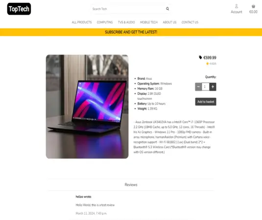

- #### Add product page

  - **Only** Admin can add new products.
  - Once in the **Product Management** which can be accessed through the **Account** menu, a add product form is displayed for the Admin to fill.
    
    

  - If submitted and no product image is selected, the form will add a default image automatically.
  - And you will also get a notification confirming it.

    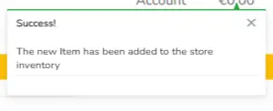

- #### Edit Product Page

  - Available only as an **Admin**, once in the product detail if logged in as Admin you will have access to **Edit** button.
  - If clicked the Admin is taken to Edit product page where the Admin will be able to update the product, like for example the price.

    

  - If updated and submitted a notification will be displayed confirming it.

    

- #### Delete product Page

  - Available only as an **Admin**, once in the product detail if logged in as Admin you will have access to **Delete** button
  - If clicked the Admin is taken to Delete product page where will be asked whether wants or not to delete the product.

    

  - If the product is deteted a notification will be displayed confirming it.

    

- #### Add Review

  - The reviews are available at the bottom of each product.
  - Everybody can read the reviews but **only** logged in Users can write a review.
  - To write a review all you have to do is scroll down in the product detail page till you see the box that says "Write a review...", type your review and click add.

    

  - If the review is submitted, it will be displayed automatically in the product reviews and you will also get a notification confirming it.

    

- #### Edit Review Page

  - **Edit** review button is displayed at the right side of the review **Only** if the logged in User is the owner of the review.
  - If clicked the User is taken to the edit review page, where will be able to update the review.

    

  - If the review is updated the User is redirected back to the product where will be able to visualize the review and also a notification is displayed confirming that the review was updated.

    

- #### Delete review Page

  - **Delete** review button is displayed at the right side of the review next to the **Edit** button **Only** if the logged in Use is the owner of the review.
  - If pressed the User is taken to the delete review page, where will be asked whether wants or not to delete the review.

    

  - If the review is deleted the User is redirected to the product page and a notification will be displayed confirming the deletion of the review.

    

- #### Basket Page

  - If the User has products added to the basket and clicks on the basket is taken to the **Basket** page.
  - Within the basket you can visualize the products, you can update product quantities and delete the products from the basket.
  - The User has also two button options, "Keep Shopping" and "Checkout".

    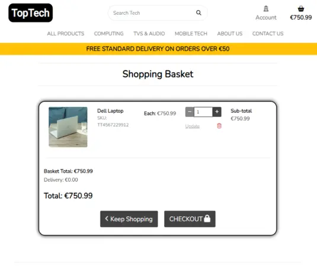

  - If Basket is empty, you will have only the "Keep Shopping" button.

    

- #### Checkout Page

  - If the User does want to checkout, the Order Summary is displayed and also a form to fill with personal details, delivery information and payment details.

    

- #### Checkout success Page

  - After the payment successfully gone through the User is taken to the checkout success page where will be able to check the Order detail.

    

  - The User will get a notification confirming it.

    

  - And also, an email with the order number confirming it.

    

  - Stripe is used to process the payments and when checking in the stripe dashboard webhooks and events, it shows that the orders have been created and payment succeeded.
    - Webhooks bellow

      

    - Webhook events bellow

      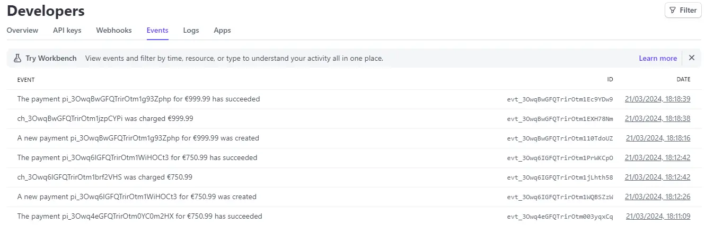

- #### Purchases Page

  - **Purchases** the User can access it through the **Account** menu.
  - When Purchases page is opened a list of the orders made is displayed.

    

- #### 404 Error Page

  - If User tried to access something that does not exists a **404 error** page is displayed, to show the User that shouldn't be there 
  - The **Home Page** button will take you back to the Home page

    

- #### Admin Page

  - As an Admin, you will have access to the Admin page where you will be able to manage the TopTech website
    - You will be able to update the Company details in About section
    - You will be able to check who contacted the company
    - You will be able to check the orders made by the Users
    - You will be able to add, update and delete Product Categories
    - You will be able to register, update and delete Users
    - You will be able to Update User profiles
    - You will be able to add, update and delete products
    - You will be able to add, update and delete product reviews

      

[**Back to the top**](#toptech "back_to_the_top")

---

### **Future features**

- Users will be able to view othe Users profiles (private information will be protected).
- Create a TopTech forum where Users will be able to exchange experiences with certain products and builds, Get help from TopTech support team with any matter.
- Add product stock levels feature for a more accuracy stock of the products.
- Add quick login feature with socials.

[**Back to the top**](#toptech "back_to_the_top")

---

## **Technologies, libraries, programs and tools used**

- [HTML5](https://en.wikipedia.org/wiki/HTML5) - Used to create the templates for the website.
- [CSS](https://en.wikipedia.org/wiki/CSS) - Used to customize the website style.
- [Javascript](https://en.wikipedia.org/wiki/JavaScript) - Used to setup the scripts functionalities.
- [Python](https://en.wikipedia.org/wiki/Python_(programming_language)) - Python language used in Django.
- [Django](https://en.wikipedia.org/wiki/Django_(web_framework)) - Django which is Python-based web framework used to develop the forum.
- [Bootstrap](https://getbootstrap.com/docs/5.3/getting-started/introduction/) - This toolkit was used to help build the website faster.
- [Codeanywhere](https://app.codeanywhere.com/) - Used to create the project.
- [Gitpod](https://gitpod.io/) - Also used to create the project.
- [Github](https://github.com/) - Where the website is stored.
- [Spell Check](https://chrome.google.com/webstore/detail/webpage-spell-check/mgdhaoimpabdhmacaclbbjddhngchjik/related) - Used to check spelling.
- [Gyazo](https://gyazo.com/) - Used to take Screenshots and host images.
- [Cloud Convert](https://cloudconvert.com/) - Used to resize and convert screenshots.
- [W3C HTML](https://validator.w3.org/#validate_by_input) - Used to check for HTML code errors.
- [W3C CSS](https://jigsaw.w3.org/css-validator/) - Used to check for CSS code errors.
- [JSHint](https://jshint.com/) - Used to check for JavaScript code errors.
- [CI Python Linter](https://pep8ci.herokuapp.com/) - Used to check for Python code errors.
- [WAVE](https://wave.webaim.org/) - Used to help improving accessibility to individuals with disabilities, by showing where there might be errors.
- [Heroku](https://dashboard.heroku.com/apps) - Used to deploy the TopTech forum website.
- [Code Institute Template](https://github.com/Code-Institute-Org/ci-full-template) - Used to create project template.
- [ElephantSQL](https://www.elephantsql.com/) - PostgreSQL database used to store the data.
- [AWS](https://aws.amazon.com/) - Used to store image.
- [Font Awesome](https://fontawesome.com/) - Used to display icons.
- [Favicon](https://favicon.io/) - Used to create the website favicon.
- [Am I Responsive?](https://ui.dev/amiresponsive) - Used to display the website on different devices.
- [Google Fonts](https://fonts.google.com/) - Used for the fonts in the website.
- [Uizard](https://uizard.io/) - Used to create the website wireframes.
- [Lucidchart](https://lucid.app/) - Used to create the Entity Relationship Diagram (ERD)
- [Microsoft Word](https://www.microsoft.com/en-gb/microsoft-365/p/word/cfq7ttc0hlkm?activetab=pivot:overviewtab) - Used to write some texts to apply in the project.
- [ColorKit](https://colorkit.co/) - Used to create the colour palette.
- [Privacy Policy Generator](https://www.privacypolicygenerator.info/) - Used to generate a privacy policy.
- [Sitemap](https://www.xml-sitemaps.com/) - Used to create a sitemap.xml file.
- [facebook](https://facebook.com) - Used to create the TopTech facebook page.
- [emailJS](https://www.emailjs.com/) - Used to create email templates and functionality for contact page.
- [Mailchimp](https://mailchimp.com/) - Used for the TopTech newsletter (marketing).
- [Stripe](https://stripe.com/) - Used to setup the payment system.

[**Back to the top**](#toptech "back_to_the_top")

---

## **Languages**

### **HTML**

- **HTML code passes with no errors when checked on W3C Markup Validation Service**

The edit product, edit profile, edit about pages have the same error duplicate attribute ID due to ```id="new-image"``` being added to where the ```id="id_image"``` already exists

  - Home page results - PASS

    

  - Contact page results - PASS

    

  - About page results - PASS

    

  - Edit about page results - Has an error

    

  - Signin page results - PASS

    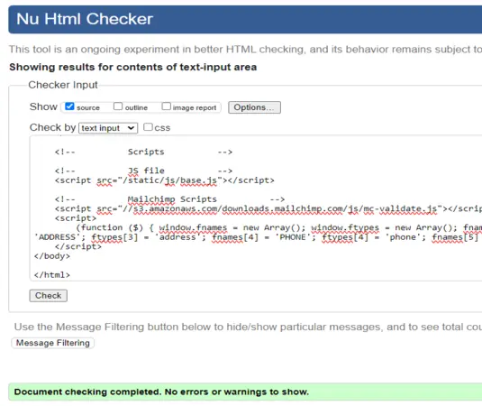

  - Signup page results - PASS

    

  - Logout page results - PASS

    

  - Profile page results - PASS

    

  - Edit profile page results - Has an error

    

  - Delete account page results - PASS

    

  - Products page results - PASS

    

  - Product detail page results - PASS

    

  - Add product page results - Has an error

    

  - Edit product page results - Has an error

    

  - Delete product page results - PASS

    

  - Edit review page results - PASS

    

  - Delete review page results - PASS

    

  - Checkout page results - PASS

    

  - Checkout success page results - PASS

    

  - Purchases page results - PASS

    

  - Basket page results - PASS

    

  - 404 Error page results - PASS

    

  - 500 Error page results - PASS

    

  - Privacy policy page results - PASS

    

### **CSS**

- **CSS code passes with no errors when checked on W3C CSS Validation Service**

  - about.css file - PASS

    

  - base.css file - PASS

    

  - checkout.css file - PASS

    

  - profile.css file - PASS

    

### **JavaScript**

- **JavaScript code passes with no errors when checked on JSHint**

  - about_country_fields.js file - PASS

    

  - base.js file - PASS

    

  - contact.js file - PASS

    

  - products.js file - PASS

    

  - profile_country_fields.js file - PASS

    

  - stripe_elements.js file - PASS

    

### **Python**

- **Python code passes with no errors when checked on CI Python Linter(toptech)**

  - toptech_urls.py - PASS

    

  - toptech_views.py - PASS

    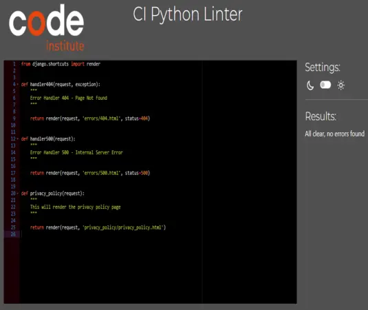

  - custom_storages.py - PASS

    

  - manage.py - PASS

    

- **Python code passes with no errors when checked on CI Python Linter(About)**

  - about_views.py - PASS

    

  - about_urls.py - PASS

    

  - about_models.py - PASS

    

  - about_forms.py - PASS

    

  - about_admin.py - PASS

    

  - about_contexts.py - PASS

    

  - about_widgets.py - PASS

    

- **Python code passes with no errors when checked on CI Python Linter(Basket)**

  - basket_views.py - PASS

    

  - basket_urls.py - PASS

    

  - basket_contexts.py - PASS

    

  - basket_basket_tools.py - PASS

    

- **Python code passes with no errors when checked on CI Python Linter(Checkout)**

  - checkout_views.py - PASS

    

  - checkout_urls.py - PASS

    

  - checkout_models.py - PASS

    

  - checkout_forms.py - PASS

    

  - checkout_admin.py - PASS

    

  - checkout_apps.py - PASS

    

  - checkout_signals.py - PASS

    

  - checkout_webhook_handler.py - PASS

    

  - checkout_webhooks.py - PASS

    

- **Python code passes with no errors when checked on CI Python Linter(Contact)**

  - contact_urls.py - PASS

    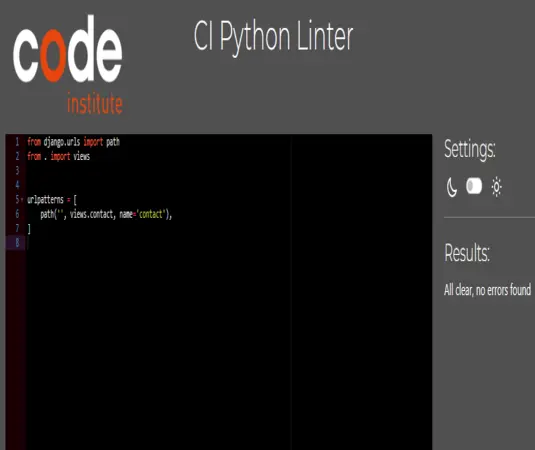

  - contact_views.py - PASS

    

  - contact_models.py - PASS

    

  - contact_forms.py - PASS

    

  - contact_admins.py - PASS

    

- **Python code passes with no errors when checked on CI Python Linter(Home)**

  - home_urls.py - PASS

    

  - home_views.py - PASS

    

- **Python code passes with no errors when checked on CI Python Linter(Products)**

  - products_urls.py - PASS

    

  - products_views.py - PASS

    

  - products_models.py - PASS

    

  - products_forms.py - PASS

    

  - products_admin.py - PASS

    

  - products_widgets.py - PASS

    

- **Python code passes with no errors when checked on CI Python Linter(Profiles)**

  - profiles_urls.py - PASS

    

  - profiles_views.py - PASS

    

  - profiles_models.py - PASS

    

  - profiles_forms.py - PASS

    

  - profiles_admin.py - PASS

    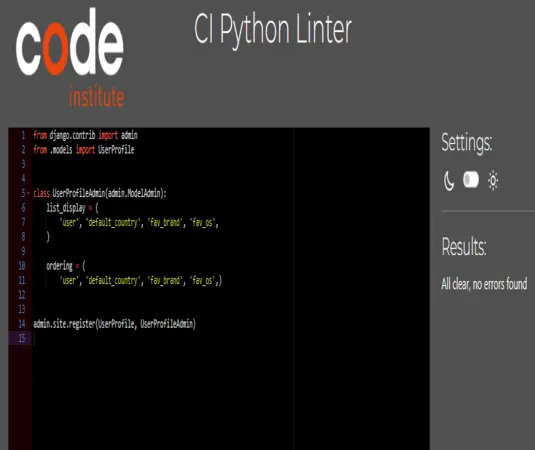

  - profiles_widgets.py - PASS

    

- **Python code passes with no errors when checked on CI Python Linter(Reviews)**

  - reviews_urls.py - PASS

    

  - reviews_views.py - PASS

    

  - reviews_models.py - PASS

    

  - reviews_forms.py - PASS

    

  - reviews_admin.py - PASS

    

[**Back to the top**](#toptech "back_to_the_top")

---

## **Accessibility**

### **Wave**

- I have focused on making sure that the [TopTech](https://toptech-244e7b312287.herokuapp.com/) website is accessible:

  - Starting with the colours that were choosen, the goal was to try to create a website with neutral/clean collours to make sure that would suit everybody's taste and that wouldn't cause problems with contrast.
  - Made sure that the website had a semantic html.
  - The navbar is clean and it adapts perfectly to smaller screen devices with no issues.
  - Kept the same layout through every page within the website.
  - In general, the website is simple and easy to use and navigate.

    - Home page results

      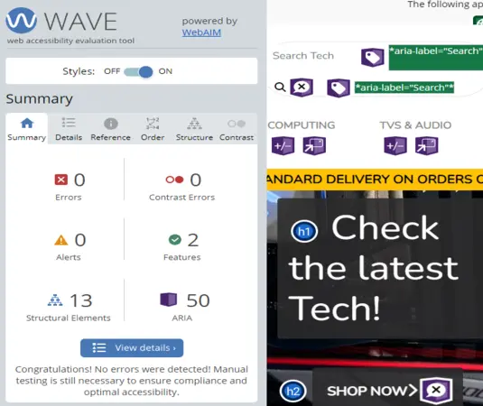

    - Contact page results

      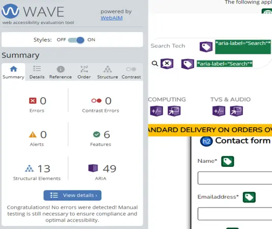

    - About page results

      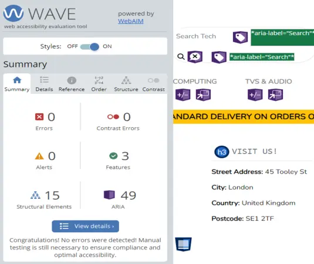

    - Edit about page results

      

    - Sign in page results

      

    - Signup page results

      

    - Logout page results

      

    - Profile page results

      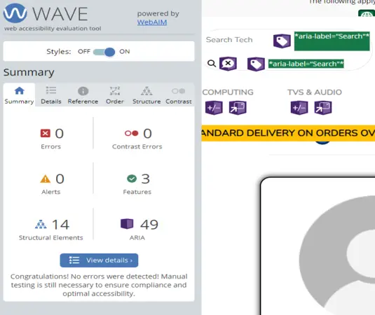

    - Edit profile page results

      

    - Delete account page results

      

    - Products page results

      

    - Product detail page results

      

    - Add product page results

      

    - Edit product page results

      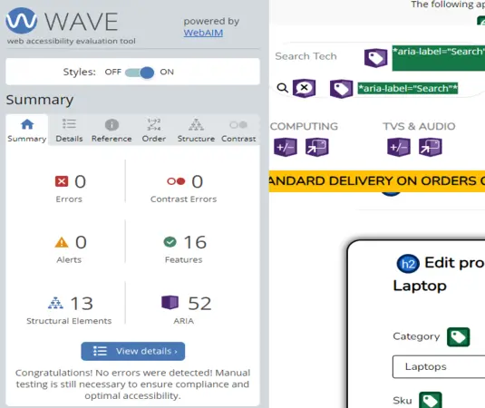

    - Delete product page results

      

    - Edit review page results

      

    - Delete review page results

      

    - Checkout page results

      

    - Checkout success page results

      

    - Purchases page results

      

    - Basket page results

      

    - 404 error page results

      

    - 500 error page results

      

    - Privacy policy page results

      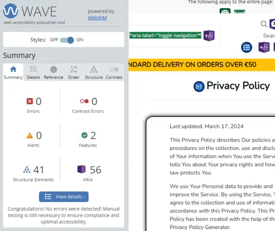

[**Back to the top**](#toptech "back_to_the_top")

---

### **Lighthouse**

- I can confirm that Lighthouse performed really good.

  - Home page results

    

  - Contact page results

    

  - About page results

    

  - Edit about page results

    

  - Sign in page results

    

  - Signup page results

    

  - Logout page results

    

  - Profile page results

    

  - Edit profile page results

    

  - Delete account page results

    

  - Products page results

    

  - Product detail page results

    

  - Add product page results

    

  - Edit product page results

    

  - Delete product page results

    

  - Edit review page results

    

  - Delete review page results

    

  - Basket page results

    

  - Checkout page results

    

  - Checkout success page results

    

  - Purchases page results

    

  - 404 error page results

    

  - 500 error page results

    

  - Privacy policy page results

    

[**Back to the top**](#toptech "back_to_the_top")

---

## **Testing**

- The TopTech website has been tested and it works on different types of computers with different browsers:
  - Chrome
  - Safari
  - Microsoft Edge
  - Firefox

- It has been tested and work on different mobile phone brands:
  - Poco F5
  - Poco F5 Pro
  - Realme x2
  - Hauwei p30 lite
  - Iphone 11 Pro
  - Iphone 12 Pro
  - Xiaomi note 8

- Various tests that were carried out by myself, friends and family, using a variety of devices from desktops with different specs, laptops, tables to mobile phones.
- Also tested in different operating systems such as macOS, IOS, Windows and Android.

[**Back to the top**](#toptech "back_to_the_top")

---

## **Manual Tests**

- ### **Navbar**

  | Feature | Expected Outcome | Testing | Result | Pass or Fail |
  | ------- | ---------------- | ------- | ------ | ------------ |
  | TopTech logo | When clicked it should take me back to the home page | Clicked the logo | Takes me back to the home page | pass |
  | Search bar | When looking for a specific product like for example 'Apple' it should display all results that contain 'Apple' within the product title or descriptions | Wrote 'Apple' and clicked on the search button | It displayed all the products from the store that contain 'Apple' | pass |
  | All Products button | It should dropdown a menu with a list ('By Price', 'By Rating', 'By Category', 'All Products') | Clicked the All products button | Dropdown menu list was displayed | pass |
  | Computing button | It Should dropdown a menu list with different categories of computers | Clicked the Computing button | Dropdown menu list was displayed | pass |
  | TVs & Audio button | It Should dropdown a menu list with different categories of TVs & Audio | Clicked the TVs & Audio button | Dropdown menu list was displayed | pass |
  | Mobile Tech button | It Should dropdown a menu list with different categories of Mobile Tech | Clicked the Mobile Tech button | Dropdown menu list was displayed | pass |
  | About Us button | When clicked it should take me to the About Us page | Clicked the About Us button | Takes me to the About Us page | pass |
  | Contact Us | When clicked it should take me to the Contact Us page | Clicked the Contact Us button | Takes me to the Contact Us page | pass |
  | Account button Logged off | It Should dropdown a menu list with ('Register' and 'Login' links) | Clicked the Account button while logged off | It has dropdown a menu list with ('Register' and 'Login' links) | pass |
  | Account button Logged in as a User | It Should dropdown a menu list with ('Profile', 'Purchases' and 'Logout' links) | Clicked the Account button while logged in as a User | It has dropdown a menu list with ('Profile', 'Purchases' and 'Logout' links) | pass |
  | Account button Logged in as an Admin | It Should dropdown a menu list with ('Admin page', 'Product management', 'About management', 'Profile', 'Purchases' and 'Logout' links) | Clicked the Account button while logged in as an Admin | It has dropdown a menu list with ('Admin page', 'Product management', 'About management', 'Profile', 'Purchases' and 'Logout' links) | pass |
  | Basket button | When clicked it should take me to the basket page | Clicked the basket button | Takes me to the Basket page | pass |
  | Basket display total | When adding products to my basket, it should display the total of my goods | Add products to the basket | The basket displays the total of my goods | pass |

- ### **Footer**

  | Feature | Expected Outcome | Testing | Result | Pass or Fail |
  | ------- | ---------------- | ------- | ------ | ------------ |
  | Facebook icon | It should open the TopTech facebook page in a new tab | Clicked on the facebook icon | Opens the TopTech facebook page in a new tab | pass |
  | Instagram icon | It should open the instagram page in a new tab | Clicked on the instagram icon | Opens the instagram page in a new tab | pass |
  | Twitter icon | It should open the twitter page in a new tab | Clicked on the twitter icon | Opens the twitter page in a new tab | pass |
  | Youtube icon | It should open the youtube page in a new tab | Clicked on the youtube icon | Opens the youtube page in a new tab | pass |
  | Mailchimp | When enter email and click subscribe it should confirm the subscription | Wrote the email and clicked on the subscribe button | Displays a confirmation for the subscription 'Thank you for subscribing!' | pass |
  | Linkedin | It should open the linkedin page in a new tab | Clicked the linkedin icon | Opens linkedin page in a new tab | pass |
  | Github | It should open the github page in a new tab | Clicked the github icon | Opens github page in a new tab | pass |

- ### **Home page**

  | Feature | Expected Outcome | Testing | Result | Pass or Fail |
  | ------- | ---------------- | ------- | ------ | ------------ |
  | Shop now button | It should take me to the products page to start shopping | Clicked on shop now button | takes me to the products page so I can start shop | pass |

- ### **Contact page**

  | Feature | Expected Outcome | Testing | Result | Pass or Fail |
  | ------- | ---------------- | ------- | ------ | ------------ |
  | Empty fields highlight | When submitting a form with empty fields it should highlight the empty fields | submitted the form with empty fields | It has highlighted the empty fields | pass |
  | Display a notification | If submitted successfully it should display a notification | Fill all the form fields and clicked submit | A notification was displayed | pass |
  | Auto reply email | After submitting the form I should be getting an auto reply email from TopTech with also a copy of my message | Fill the form and clicked submit | After submitting the form I did get an email from TopTech with also a copy of my message | pass |

- ### **About page**

  | Feature | Expected Outcome | Testing | Result | Pass or Fail |
  | ------- | ---------------- | ------- | ------ | ------------ |
  | Display information | The about page should display information about TopTech | Opened About Us page | The about us page displayed information about TopTech | pass |

- ### **Edit about page**

  | Feature | Expected Outcome | Testing | Result | Pass or Fail |
  | ------- | ---------------- | ------- | ------ | ------------ |
  | Empty fields highlight | When submitting a form with empty required fields it should highlight the empty fields | submitted the form with empty fields that are required | It has highlighted the empty required fields | pass |
  | Current image | It should display the current image | When in the Edit about page | It displays the current image | pass |
  | Cancel button | If clicked cancel button it should take me back to the About page | Clicked the cancel button | It takes me back to the About page | pass |
  | Edit About button | After updating the details if clicked **Edit about** button it should save/update the About information | clicked the Edit About button | It did update the About information | pass |
  | Redirected | It should redirect to About Us page | Submit the form | I was redirected to the About Us page | pass |
  | Display a notification | If submitted successfully it should display a notification | Fill all the form fields and clicked submit | A notification was displayed | pass |

- ### **Sign in page**

  | Feature | Expected Outcome | Testing | Result | Pass or Fail |
  | ------- | ---------------- | ------- | ------ | ------------ |
  | Empty fields highlight | When submitting with empty fields it should highlight the empty fields | Clicked Sign in with empty fields | It has highlighted the empty fields | pass |
  | Valid Username | It should check whether or not the Username exists | Clicked Sign in with non-existing Username | It displays the following message 'The username and/or password you specified are not correct.' | pass |
  | Valid Password | It should check whether or not the Password is correct | Clicked Sign in with wrong password | It displays the following message 'The username and/or password you specified are not correct.' | pass |
  | Redirected | If Sign in is successfully it should redirect to the home page | Clicked Sign in with correct details | I was redirected to the home page | pass |
  | Notification | If Sign in is successfully it should display a notification | Clicked Sign in with correct details | A notification was displayed | pass |

- ### **Sign up**

  | Feature | Expected Outcome | Testing | Result | Pass or Fail |
  | ------- | ---------------- | ------- | ------ | ------------ |
  | Empty fields highlight | When submitting with empty fields it should highlight the empty fields | Clicked Sign in with empty fields | It has highlighted the empty fields | pass |
  | Matching email | It should check whether or not the emails match | Submit with different emails | It displays the following message 'You must type the same email each time.' | pass |
  | Matching password | It should check whether or not the passwords match | Submit with different passwords | It displays the following message 'You must type the same password each time.' | pass |
  | Short password | It should check if the password entered is too short | Submit with a short password | It displays the following message 'This password is too short. It must contain at least 8 characters.' | pass |
  | Username | It should check if the username is already in use | Submit with a username already in use | It displays the following message 'A user with that username already exists.' | pass |
  | Email | It should check if the email is already in use | Submit with an email already in use | It displays the following message 'A user is already registered with this e-mail address.' | pass |
  | Redirect confirm-email | It should redirect you to the confirm-email page where you are told to check your email to finalize the sign up process | Entered correct details and clicked Sign up | I am redirected to confirm-email page where I am told to verify my email to finalize the sign up process | pass |
  | Email link | When I click the link I should be redirected back to the website to confirm | Check the email and clicked the link | I am redirected back to the TopTech website where I am asked to confirm | pass |
  | Redirect Sign in | If I do confirm I should be redirected to the Sign in page | Clicked the confirm button | I was redirected to the Sign in page | pass |
  | Notification | If I do confirm it should display a notification | Clicked the confirm button | A notification was displayed | pass |

- ### **Logout**

  | Feature | Expected Outcome | Testing | Result | Pass or Fail |
  | ------- | ---------------- | ------- | ------ | ------------ |
  | Logout question | It should display a question whether the User wants to logout or not | Clicked logout link in the **Account** menu | The Logout page displays the question whether I want or not to logout | pass |
  | Logout | If clicked Sign out I should be logged out | Clicked Sign Out | I am automatically logged out | pass |
  | Redirect | If I do logout I should be redirected to the Home page | Clicked Sign Out | I was redirected to the home page | pass |
  | Notification | If I do logout it should display a notification | Clicked Sign Out | A notification was displayed | pass |

- ### **Profile page**

  | Feature | Expected Outcome | Testing | Result | Pass or Fail |
  | ------- | ---------------- | ------- | ------ | ------------ |
  | Display profile | It should display the User information and profile photo | Enter the profile page | When entered in the profile, it starts with a profile picture and is followed by the information | pass |
  | Danger section | Located at the end of the profile page is where the User will have the 'Edit' and 'Delete' buttons | Enter the profile page | It displays the Danger section at the end | pass |
  | Edit button | When clicked it should take me to the edit profile page | Clicked the edit button | Takes me to the edit profile page, where I can update my profile | pass |
  | Delete button | When clicked it should take me to the delete account page | Clicked the delete button | Takes me to delete account page | pass |

- ### **Edit profile page**

  | Feature | Expected Outcome | Testing | Result | Pass or Fail |
  | ------- | ---------------- | ------- | ------ | ------------ |
  | Edit profile | it should display an edit profile form so User can Update details | Entered edit profile page | An edit profile form is displayed | pass |
  | Cancel button | If clicked cancel button it should take me back to the profile page | Clicked the cancel button | It takes me back to the profile page | pass |
  | Current image | It should display the current image | When in the Edit Profile page | It displays the current image | pass |
  | Update profile button | After updating the details if clicked it should save/update the profile details | clicked the update profile button | It did update the profile | pass |
  | Redirect | It should redirect me to Profile page | Submit the form | I was redirected to the Profile page | pass |
  | Notification | If submitted successfully it should display a notification | Fill all the form fields and clicked submit | A notification was displayed | pass |

- ### **Delete account page**

  | Feature | Expected Outcome | Testing | Result | Pass or Fail |
  | ------- | ---------------- | ------- | ------ | ------------ |
  | Delete account | It should display a question whether you are sure or not to delete your account | Entered the delete account page | It displays the question | pass |
  | Cancel button | If clicked cancel button it should take me back to the profile page | Clicked the cancel button | It takes me back to the profile page | pass |
  | Delete account button | If click delete account it will delete it from the database | Clicked delete account | Account was deleted | pass |
  | Redirect | If click delete account button I will be redirected to the home page | Clicked delete account | I was redirected to the home page | pass |
  | Notification | If click delete account button, it will display a notification confirming it | Clicked delete account | It displayed a notification confirming it | pass |
  | Account deleted | When trying to logging with the deleted account it should display that the account doesn't exist | Tried to login | It displays the following message 'The username and/or password you specified are not correct.' | pass |

- ### **Products page**

  | Feature | Expected Outcome | Testing | Result | Pass or Fail |
  | ------- | ---------------- | ------- | ------ | ------------ |
  | All Products | It should display all products available in stock | Clicked all Products | It displays all products available in stock | pass |
  | Product info | It should display Main features of each product | Entered Products page | It displays main features of each product | pass |
  | Clickable product | I should be able to click the product to check the details | Clicked the desired product | Takes me to the Product detail and it displays all details of the product | pass |
  | Display the price | It should display the price on each product | Entered Products page | Each product displays the price | pass |
  | Display the category | It should display the category on each product | Entered Products page | Each product displays the category | pass |
  | Category link | On each product should be a category link that when clicked displays all products from that category | Clicked the category link on a certain product | All products from that category are displayed | pass |
  | Add to basket button | It should display 'add to basket' button on each product | Entered Products page | Each product displays an 'Add to basket' button | pass |
  | By Price | It should display all products available in stock by Price | Clicked by Price | It displays all products available in stock by Price | pass |
  | By Rating | It should display all products available in stock by Rating | Clicked by Rating | It displays all products available in stock by Rating | pass |
  | By Category | It should display all products available in stock by Category | Clicked by Category | It displays all products available in stock by Category | pass |
  | Sort By | When sorting by price, rating and name it should display in the selected order | Tried Sort by price, rating and name in any order | It Sorted all products by price, rating and name in any order | pass |
  | All Computers | It should display all computers available in stock | Clicked All Computers | It displays all the Computers available in stock | pass |
  | Laptops | It should only display all Laptops available in stock | Clicked Laptops | It displays all the laptops available in stock | pass |
  | Desktops | It should only display all Desktops available in stock | Clicked Desktops | It displays all the Desktops available in stock | pass |
  | Gaming computers | It should only display all Gaming computers available in stock | Clicked Gaming computers | It displays all the Gaming computers available in stock | pass |
  | All TVs & Audio | It should display all TVs & Audio available in stock | Clicked All TVs & Audio | It displays all the TVs & Audio available in stock | pass |
  | Radios | It should only display all Radios available in stock | Clicked Radios | It displays all the Radios available in stock | pass |
  | Headphones | It should only display all Headphones available in stock | Clicked Headphones | It displays all the Headphones available in stock | pass |
  | Home cinema | It should only display all home cinema available in stock | Clicked Home cinema | It displays all the home cinema available in stock | pass |
  | TVs | It should only display all TVs available in stock | Clicked TVs | It displays all the TVs available in stock | pass |
  | All Mobile Tech | It should display all Mobile Tech available in stock | Clicked All Mobile Tech | It displays all the Mobile Tech available in stock | pass |
  | Mobile phones | It should only display all Mobile phones available in stock | Clicked Mobile phones | It displays all the Mobile phones available in stock | pass |
  | Tablets | It should only display all Tablets available in stock | Clicked Tablets | It displays all the Tablets available in stock | pass |
  | Pagination | It should display pagination if there are more than 25 products in a page | Selected all products to display more than 25 products | Pagination appears and works | pass |

- ### **Product Detail page**

  | Feature | Expected Outcome | Testing | Result | Pass or Fail |
  | ------- | ---------------- | ------- | ------ | ------------ |
  | Product | When I enter the product, I should be able to see all details | Clicked the desired product | Opens the product detail page where all details are displayed | pass |
  | Edit button | Only displays when logged in as an Admin | Entered the product as a Guest, User and Admin | The Edit button only displayed as an Admin | pass |
  | Delete button | Only displays when logged in as an Admin | Entered the product as a Guest, User and Admin | The Delete button only displayed as an Admin | pass |
  | Display the price | It should display the price on the product | Entered desired product page | The product displays the price | pass |
  | Quantity | I should be able to select the quantity of the product | Entered desired product page | It displays the option to select the quantity desired | pass |
  | Add to basket button | It should display 'add to basket' button on the product | Entered desired product page | The product displays an 'Add to basket' button | pass |
  | Main features | It should display Main features of the product | Entered desired product page | It displays main features of the product | pass |
  | Detailed information | It should display detailed information of the product | Entered desired product page | It displays detailed information of the product | pass |
  | Display Reviews | If there are reviews of the product it will display them at the bottom | Entered desired product page | The reviews were displayed under the product information | pass |
  | Display Add review | Checks whether you are logged in or not | Tried as a Guest and logged in | The Add review box only displays to logged in Users | pass |
  | Review author| Checks whether you are or not the review author | Tried as a Guest and logged in as the review author | The Edit and Delete buttons only display when logged in as the author of them | pass |
  | Edit Review button | When clicked it should take me to the edit Review page | Clicked the edit button | Takes me to the edit Review page, where I can update my Review | pass |
  | Delete Review button | When clicked it should take me to the delete Review page | Clicked the delete button | Takes me to delete Review page | pass |

- ### **Add Product page**

  | Feature | Expected Outcome | Testing | Result | Pass or Fail |
  | ------- | ---------------- | ------- | ------ | ------------ |
  | Products management | It should display an Add product form | Entered Products management | The Add product form is displayed | pass |
  | Cancel button | If clicked cancel button it should take me back to the products page | Clicked the cancel button | It takes me back to the products page | pass |
  | Empty fields highlight | When submitting a form with empty required fields it should highlight the empty fields | submitted the form with required empty fields | It has highlighted the required empty fields | pass |
  | Add Product button | It should create a new product if successfully submitted | Fill the form and clicked add product | The new product was successfully created | pass |
  | Redirected | It should redirect me to create product page | Submit the form | I was redirected to the new product page | pass |
  | Display a notification | If submitted successfully it should display a notification | Fill all the form fields and clicked add product | A notification was displayed | pass |

- ### **Edit product page**

  | Feature | Expected Outcome | Testing | Result | Pass or Fail |
  | ------- | ---------------- | ------- | ------ | ------------ |
  | Edit product | it should display an edit product form so Admin can Update the product details | Entered edit product page | An edit product form is displayed | pass |
  | Cancel button | If clicked cancel button it should take me back to the product page | Clicked the cancel button | It takes me back to the product page | pass |
  | Current image | It should display the current image | When in the Edit product page | It displays the current image | pass |
  | Empty fields highlight | When submitting a form with empty required fields it should highlight the empty fields | submitted the form with required empty fields | It has highlighted the required empty fields | pass |
  | Edit product button | After updating the details if clicked it should save/update the product details | clicked the Edit product button | It did update the product | pass |
  | Redirected | It should redirect me to Product page | Submit the form | I was redirected to the product page | pass |
  | Display a notification | If submitted successfully it should display a notification | Fill all the form fields and clicked Edit product | A notification was displayed | pass |

- ### **Delete product page**

  | Feature | Expected Outcome | Testing | Result | Pass or Fail |
  | ------- | ---------------- | ------- | ------ | ------------ |
  | Delete Product | It should display a question whether you are sure or not to delete the product | Entered the delete product page | It displays the question | pass |
  | Cancel button | If clicked cancel button it should take me back to the product page | Clicked the cancel button | It takes me back to the product page | pass |
  | Delete product button | If click delete product it will delete it from the database | Clicked delete product | Product was deleted | pass |
  | Redirect | If click delete product button I will be redirected to the products page | Clicked delete product | I was redirected to the products page | pass |
  | Notification | If click delete products button, it will display a notification confirming it | Clicked delete product | It displayed a notification confirming it | pass |
  | Product deleted | When trying to Search/look for the product after being deleted it doesn't exist | Tried to search/look for the product | It does not exist even if you type the product ID | pass |

- ### **Basket page**

  | Feature | Expected Outcome | Testing | Result | Pass or Fail |
  | ------- | ---------------- | ------- | ------ | ------------ |
  | Entered empty basket page | It should display a message and button to carry on shopping | Entered the empty basket | Message was displayed and a button to carry on shopping | pass |
  | Entered Basket page | If it has goods, it should display them | Entered a basket with goods | Basket page displays the goods that I have added | pass |
  | Keep Shopping button | If clicked I should be taken back to the products page | Clicked the Keep Shopping button | I was taken back to the products page | pass |
  | Checkout button | If clicked it should take me to the checkout page | Clicked the checkout button | I was taken to the checkout page | pass |
  | Update quantity | I should be able to update the quantity of my products in the basket | I use the basket function to update the quantity of the products | I was able to update the quantity of the products | pass |
  | Remove products | If I click the bin (delete) button it should remove the product from my basket | Clicked on the bin from the selected product | The product was removed from the basket | pass |

- ### **Checkout page**

  | Feature | Expected Outcome | Testing | Result | Pass or Fail |
  | ------- | ---------------- | ------- | ------ | ------------ |
  | Entered the checkout page | It Should display the list of my products and a form to fill | Entered the checkout | A list of my products and form to fill are displayed | pass |
  | Empty fields highlight | When submitting a form with empty required fields it should highlight the empty fields | submitted the form with required empty fields | It has highlighted the required empty fields | pass |
  | Adjust button | If clicked it should take me back to the basket | Clicked the adjust button | I was taken back to the basket | pass |
  | Complete Order | It should checkout the order | Clicked after filling the form | The order was put in place | pass |
  | Invalid card | If I enter the details of an invalid card, it should display a message | Entered invalid card details | A message was displayed 'Your card number is invalid.' | pass |
  | Redirect | If click Complete order and the purchase was successful it should redirect me to checkout success page where my order is displayed | Clicked Complete order | I was redirected to the checkout success page where my order is displayed | pass |
  | Notification | If click Complete order and the purchase was successful, it will display a notification confirming it | Clicked Complete order | It displayed a notification confirming it | pass |

- ### **Checkout Success page**

  | Feature | Expected Outcome | Testing | Result | Pass or Fail |
  | ------- | ---------------- | ------- | ------ | ------------ |
  | Entered Checkout success | It should display the order details | Clicked Complete order | Entered the checkout success and displayed my order details | pass |
  | Shop again button | When clicked it should take me to the products | Clicked the Shop again button | I was taken to the products page | pass |

- ### **Purchases page**

  | Feature | Expected Outcome | Testing | Result | Pass or Fail |
  | ------- | ---------------- | ------- | ------ | ------------ |
  | Purchases page | If you made any orders, it should display a list of your orders | Entered the Purchases page | A list of my orders was displayed | pass |
  | Empty Purchases page | If you haven't made any orders, it should display a message and a button to keep shopping | Entered the Purchases page | A message and 'Keep Shopping' button were displayed | pass |
  | Order number | When clicked it will take you to the Order details page | Clicked the order number | I was taken to the Order details page | pass |

- ### **Admin page**

  | Feature | Expected Outcome | Testing | Result | Pass or Fail |
  | ------- | ---------------- | ------- | ------ | ------------ |
  | About | As an Admin you should be able to update the company details | Update the company details | The details were updated and a notification was displayed | pass |
  | Delete User | As an Admin you should be able to delete any User | Selected User and delete | The User was deleted from the database and notification was displayed | pass |
  | Update User | As an Admin you should be able to Update any User | Selected User and update | The User was updated and notification was displayed | pass |
  | Add Product | As an Admin you should be able to add a Product | add a product | Added a product and notification was displayed | pass |
  | Delete product | As an Admin you should be able to delete any product | Selected product and delete | The product was deleted from the database and notification was displayed | pass |
  | Update Product | As an Admin you should be able to Update any Product | Selected Product and update | The Product was updated and notification was displayed | pass |
  | Categories | As an Admin you should be able to add new categories | Add new categories | New categories created and a notification was displayed | pass |
  | Delete Categories | As an Admin you should be able to delete categories | Selected category and delete | The category was deleted and a notification was displayed | pass |
  | Delete Review | As an Admin you should be able to delete any Review | Selected Review and delete | The Review was deleted from the database and notification was displayed | pass |
  | Update Review | As an Admin you should be able to Update any Review | Selected Review and update | The Review was updated and notification was displayed | pass |
  | Orders | As an Admin you should be able to check the orders that were made | Go to Orders menu | Able to check what orders were made | pass |
  | Contact | As an Admin you should be able to check contact forms that were submitted | Go to Contact menu | Able to check what contact forms were submitted | pass |

[**Back to the top**](#toptech "back_to_the_top")

---

## **Bugs**

- I found a bug when displaying the info in the footer, If I was in the about page, the info in footer would display with no issues but not in the other pages the info would be blank.

  - I had to create a contexts.py in the About app, move the following code from views.py to the contexts.py

    ```ruby
      from .models import About

      def about_contents(request):
          """
          To render the about info in every page footer
          """

          about = About.objects.first()

          context = {
              'about': about,
          }

          return context
    ```

  - And also had to add the following to the list of context processors in the templates variable within the settings.py in order to render the context in every page footer.

    ```ruby
      'about.contexts.about_contents',
    ```

- After setting up send emails, when trying to signup I was getting a server timeout error ```SMTP.starttls() got an unexpected keyword argument 'keyfile'```, to fix this I did the following

  - I had to create a file named ```runtime.txt``` with ```python-3.9.16``` in it
  - After doing that I was getting another error but this time was when trying to deploy to Heroku which was failing. To fix it I had to downgrade the urllib3 from ```==2.0.7``` to ```==1.26.15```

- The navbar had a bug, the issue was when clicking on one of the menus to dropdown the choices, it would only show the choices when clicked a second time.

  - After researching about it I found that the issue was being caused by having a duplicate bootstrap.min.js file script as it was being called twice. So, to fix it I deleted one of the scripts and now works fine.

- The facebook link in the footer wasn't displaying the URL that was stored in the database.

  - The issue was in the footer template, the facebook url wasn't being called properly instead of having ```{{ facebook_url }}``` in the footer template, I had ```{{ facebook.url }}``` as seen on the following photos.

    

  - This what was happening when trying to access the facebook link, it was displaying the edit about directory.

    

  - Once I changed it to ```{{ facebook_url }}``` the issue was gone.

[**Back to the top**](#toptech "back_to_the_top")

---

## **SEO (Search Engine Optimization) and Marketing**

### **Business Model**

- The business model used is a B2C (Business to Consumer) ecommerce as it is a process of selling products directly between a business and consumers, in this case TopTech website sells products directly to its consumers.
- The target audience for the TopTech website is mainly the Tech enthusiasts but, it has a variety of Tech that suits any audience with competitive prices.

### SEO

- As part of SEO in the base.html template the meta keywords were carefully selected and meta description tag is short but well descriptive.
- sitemap.xml file was created using the [XML-sitemaps.com](https://www.xml-sitemaps.com/), once created the file was uploaded to the project root.
- robots.txt file was created at the root of the project and tells search crawlers which URLs the crawler can access on the website.

### **Facebook**

Facebook was one of the tools used to the web marketing as it is a social media platform and it is used by millions of people, that makes it a good tool to promote the website.

- The website can be found in the following
[TopTech Facebook](https://www.facebook.com/profile.php?id=61557573443117)

- And also I have taken screenshots of it which can be seen below

  

  

  

  

### **Mailchimp***

Mailchimp is a marketing automation and email marketing platform and is used in TopTech, allows Users to subscribe to the Toptech newsletter to stay update with the latest Tech.

- Users can find it in the footer, once they enter the email and click subscribe, a notification will be displayed as seen on the photo

  

- Mailchimp tool allows you to overview and manage contacts

  

[**Back to the top**](#toptech "back_to_the_top")

---

## **Deployment**

### **Fork the repository**

1. Open Github.

2. Log in or sign up.
3. Look for my repository [TopTech](https://github.com/b1ndark/project5).
4. Last on the right corner you will find the fork button(click on it).

### **Clone the repository**

1. Open **[Github](https://github.com/)**
2. Log in or Sign up
3. Look for my repository [TopTech](https://github.com/b1ndark/project5)
4. Look for code button next to the Gitpod button at the top right(click on it).
5. A window will pop up with options for you to select to clone it with such as HTTPS, SSH or GitHub CLI.
6. Once selected copy the link that is shown.
7. Open your code editor terminal.
8. Type `git clone` in the terminal and paste the copied repository link.
9. After all that just Press enter to create the clone.
10. Once the workspace(x) is opened type the following command to install all the required packages to ruin the app

    - Type the command ```pip install -r requirements.txt```

11. Within the settings make sure to set ```DEBUG = True```
12. Before deploying it, when all the modifications done make sure to set ```DEBUG = False```, because if left True it might expose vulnerabilities, so to minimize the security risk set it to 'False'
13. After setting it to False commit your changes by adding the following
    - Type the command ```git add .```
    - Type the command ```git commit -m "commit message"```
    - At last type the command ```git push```

[**Back to the top**](#toptech "back_to_the_top")

---

### **ElephantSQL**

1. First go to **[ElephantSQL website](https://www.elephantsql.com/)**
2. If you already have an account login if not create an account.
3. Once logged in please click "+ Create New Instance" on the top right hand corner.
4. Add a name and the plan select "Tiny Turtle(Free)". Press Select Region.
5. Select your Region and click "Review".
6. Review all details and you are happy with it click "Create Instance".
7. Once the instance is created you will be redirected to the instance dashboard.
8. Go to details and copy the instance URL.
9. Within your workspace if you haven't got and "env.py" file create one.
10. In your "env.py" type the Following
    - type ```import os```
    - type ```os.environ["DATABASE_URL"]="<copied URL from elephantSQL>"```
11. Now go to your settings.py file and add the following
    - type

        ```ruby
        if os.path.isfile('env.py'):
            import env
        ```

    - then type

        ```ruby
        # DATABASES = {
        #     'default': {
        #         'ENGINE': 'django.db.backends.sqlite3',
        #         'NAME': BASE_DIR / 'db.sqlite3',
        #     }
        # }
            
        DATABASES = {
            'default': dj_database_url.parse(os.environ.get("DATABASE_URL"))
        }
        ```

12. Now after setting it all up, you have to run migrations so in your terminal type
    - First type
        ```python3 manage.py makemigrations```

    - Then type
        ```python3 manage.py migrate```

13. Now to confirm go back to your elephantSQL instance dashboard and on the left select "BROWSER".
14. Click "Table queries" and you will be able to see your database structure.
15. Last make sure to commit so it's all saved.

[**Back to the top**](#toptech "back_to_the_top")

---

### **AWS S3 bucket setup**

1. Go to **[AWS Amazon](https://aws.amazon.com/)**.

2. Sign in or Sign up if you haven't got an account.
3. You will see the dashboard once you logged in.
4. At the top search for S3 buckets
5. As you get to the S3 buckets dashboard on the right click on Create bucket
6. **AWS Region** choose the closest to you
7. **Bucket name** try to give the same as your app
8. **Object Ownership** choose ACLs enable
9. At the **Block Public Access settings for this bucket**, Uncheck block all public access, the rest of the options leave as they are and press **Create bucket**
10. Now on the S3 buckets dashboard click on the bucket you just created
11. On the **Properties** tab, scroll down to **Static website hosting** and click **Edit**
12. Within the **Static website hosting** select **Enable** and the index document and Error document just use the default values "index.html" and "error.html", and then click **Save**
13. Now **Permissions** scroll down to **Cross-origin resource sharing (CORS)** and click **Edit**
14. Add the following code and click **Save Changes**
    ```ruby
    [
        {
            "AllowedHeaders": [
                "Authorization"
            ],
            "AllowedMethods": [
                "GET"
            ],
            "AllowedOrigins": [
                "*"
            ],
            "ExposeHeaders": []
        }
    ]
    ```
15. Next go to **Bucket Policy** and on the right click on **Policy generator**
16. In the **Select Policy Type** select **S3 Bucket Policy**
17. In the **Pricipal** type "*"
18. In the **Actions** select **GetObject**
19. Now in the other tab within the **Bucket Policy** copy the ARN ```arn:aws:s3:::bucket-name```, go back to the **Policy generator** tab and past the ARN in to the **Amazon Resource Name (ARN)**
20. Click **Add Statement** and then click in **Generate Policy** and copy the generated policy in to the **Bucket Policy Editor**, before you save it add a "/*" on to the end of the resource key, then save
21. Now within the **Permissions** tab go to **Access Control List** and click **Edit**
22. Within the **Everyone (public access)** enable **List**, accept the warning box and click **Save changes**
23. Now at the top search for IAM (Identify and Access Management) and click on it
24. Once in the IAM dashboard, on the left click on **User groups** then on the right click on **Create group**
25. At the **User group name** give it a name for example ```manage-app-name``` and at the bottom click **Create group**
26. Now on the left click in **Policies** and on the right click **Create policy**
27. On the right select the json tab, then click **Actions** and then **Import policy**
28. Search for **AmazonS3FullAccess** and import it, after that get the ARN from **Bucket Policy Editor** and past it in the "resource" within the Policy editor, show look like the one below
29. 
    ```ruby
    {
      "Version": "2012-10-17",
      "Statement": [
        {
          "Sid": "Statement1",
          "Effect": "Allow",
          "Action": [
            "s3:*",
            "s3-object-lambda:*"
          ],
          "Resource": [
              "arn:aws:s3:::bucket-name",
              "arn:aws:s3:::bucket-name/*"
          ]
        }
      ]
    }
    ```
30. Click **Review Policy**, give it a **Name** "appName-policy" and a **Description** "Access to S3 bucket for appName static files", click **Create policy**
31. Go back to **User groups** click on your app group "manage-appName", go to **Permissions** tab, on the right click **Add permissions** and click **Attach policies**, search for the policy that you just created, select it and click **Attach Policies**
32. On the left click on **Users** link, once is opened on your right click **Create user**, on the **User name** type a user name "appName-staticfiles-user" and click **Next**
33. Under **Set permissions** select **Add user to group**, select the group that you are adding to "manage-app-name" and click **Next** and **Create User**
34. Go back to Users menu and select the User you just created and, on the right, click on **Create access key**, Select the Option **Application running outside AWS** and click **Next**, the **Description ta value** leave it blank and click **Create access key**
35. Click **Download .csv file** as it contains the **Access key ID** and the **Secret access key** which you will need them to authenticate
36. Now back in your app you need to install both Boto3 ```pip3 install boto3``` and Django-storages ```pip3 install django-storages``` and make sure to freeze afterwards ```pip3 freeze > requirements.txt```
37. Now in setting add ```'django-storages',``` to the Installed apps, then still within the settings add the following
    ```ruby
    if 'USE_AWS' in os.environ:
    # Cache control
    AWS_S3_OBJECT_PARAMETERS = {
        'Expires': 'Thu, 31 Dec 2099 20:00:00 GMT',
        'CacheControl': 'max-age=94608000',
    }

    # Bucket Config
    AWS_STORAGE_BUCKET_NAME = 'your bucket name'
    AWS_S3_REGION_NAME = 'your account region'
    AWS_ACCESS_KEY_ID = os.environ.get('AWS_ACCESS_KEY_ID')
    AWS_SECRET_ACCESS_KEY = os.environ.get('AWS_SECRET_ACCESS_KEY')
    AWS_S3_CUSTOM_DOMAIN = f'{AWS_STORAGE_BUCKET_NAME}.s3.amazonaws.com'

    # Static and media files
    STATICFILES_STORAGE = 'custom_storages.StaticStorage'
    STATICFILES_LOCATION = 'static'
    DEFAULT_FILE_STORAGE = 'custom_storages.MediaStorage'
    MEDIAFILES_LOCATION = 'media'

    # Override static and media Urls in production
    STATIC_URL = f'https://{AWS_S3_CUSTOM_DOMAIN}/{STATICFILES_LOCATION}/'
    MEDIA_URL = f'https://{AWS_S3_CUSTOM_DOMAIN}/{MEDIAFILES_LOCATION}/'
    ```
38. In your app create a new file called "custom_storages.py" to tell django to use S3 to store static files when someone runs collectstatic and also to store any uploaded images, the custom_storages.py code is bellow
    ```ruby
    from django.conf import settings
    from storages.backends.s3boto3 import S3Boto3Storage


    class StaticStorage(S3Boto3Storage):
        location = settings.STATICFILES_LOCATION


    class MediaStorage(S3Boto3Storage):
        location = settings.MEDIAFILES_LOCATION

    ```

[**Back to the top**](#toptech "back_to_the_top")

---

### **Stripe setup**

1. Go to [Stripe](https://stripe.com/gb)

2. Sign in or Sign up if you haven't got an account.
3. Once in the dashboard click in **Developers** on the top right corner
4. On the top click on **Webhooks**
5. If you haven't created an endpoint yet then, click on **Add endpoint**
6. At the Endpoint URL type ```https://appName.herokuapp.com/checkout/wh```
7. Select all events and click **Add endpoint**
8. Get the webhook secret key and add it to your **Heroku Config Vars**
8. Now run your app and test the transactions to check if everything is working, if it is working it will display the transactions in the webhooks tab.

[**Back to the top**](#toptech "back_to_the_top")

---

### **Heroku deployment**

1. Within your opened project in Codeanywhere or Gitpod you will have to freeze requirements.txt file

    - Type the command ```pip3 freeze > requirements.txt```

    

2. Go to your settings.py file and change DEBUG to "False".
3. Add the following to your settings.py file

   ```ruby
   ALLOWED_HOSTS = ['localhost', 'your-app-name.herokuapp.com']
   ```

4. Store all the sensible data such as for "SECRET_KEY" and "DATABASE_URL" into to the "env.py" file.
5. Double check if "env.py" file is in your ".gitignore" file so it is stopped from being uploaded.
6. Make sure you commit and push it.
7. Open and login to your Heroku account.
8. Once your dashboard opens, on the top right-hand corner click on New and then on the Create new app.
9. Give your app a name and select the location.
10. Once created, the app dashboard will open.
11. Select Settings tab.
12. Go down to Config Vars
    - add to Key "PORT" and to add value "8000"
    - add to key "DATABASE_URL" and to add value "your Postgres url"
    - add to key "SECRET_KEY" and to add value "your secret key"
    - add to key "AWS_ACCESS_KEY_ID" and to add value "your aws access key id"
    - add to key "AWS_SECRET_ACCESS_KEY" and to add value "your aws secret access key"
    - add to key "USE_AWS" and to add value "True"
    - add to key "STRIPE_PUBLIC_KEY" and to add value "Stripe public key"
    - add to key "STRIPE_SECRET_KEY" and to add value "Stripe secret key"
    - add to key "STRIPE_WH_SECRET" and to add value "Stripe webhook secret"
13. Next go to Buildpacks and add "heroku/python" and "heroku/nodejs"

    - Make sure they are in this order first "heroku/python" and then in second "heroku/nodejs"

14. After all that select Deploy tab.
15. Go down to Deployment method and select GitHub.
16. Connect to your GitHub and enter the repository.
17. Once is connected you can either have automatic or manual deployment.
18. Choose your preferred one by pressing deploy.
19. Once the app is successfully deployed click "View"

[Live project](https://toptech-244e7b312287.herokuapp.com/)

[**Back to the top**](#toptech "back_to_the_top")

---

## **Credits**

- ### **Content**

  - Various resources were used to help throughout the project:

    - Code Institute Think before I blog tutorial was a good help throughout the project, from setting up the project, building it to the deployment.
    - [Font-anwsome libraries](https://cdnjs.com/libraries/font-awesome)
    - [Customizing error views](https://docs.djangoproject.com/en/3.2/topics/http/views/#customizing-error-views)
    - [Bootstrap](https://getbootstrap.com/docs/5.3/getting-started/introduction/)
    - Django documentation [Django](https://docs.djangoproject.com/en/5.0/)
    - [Django Crispy forms](https://django-crispy-forms.readthedocs.io/en/latest/install.html)
    - [Basic setup and deployment](https://docs.google.com/document/d/1P5CWvS5cYalkQOLeQiijpSViDPogtKM7ZGyqK-yehhQ/edit#heading=h.5s9novsydyp1)
    - For the forum rules [Elm](https://discourse.elm-lang.org/faq)
    - To help out with active links [Stackoverfow](https://stackoverflow.com/questions/39639264/django-highlight-current-page-in-navbar)
    - For generic views [Django docs](https://docs.djangoproject.com/en/3.2/topics/class-based-views/generic-display/)
    - For Edit generic views [Django docs](https://docs.djangoproject.com/en/3.2/topics/class-based-views/generic-editing/)
    - Bootstrap [alerts](https://getbootstrap.com/docs/5.0/components/alerts/)
    - To display labels in kanban view [Github community](https://github.com/orgs/community/discussions/10788)
    - To help improving the User experience by being able to close the message box when clicked anywhere in the screen I have found the following link that have helped me understand and implement the logic [How to close the box by clicking anywhere](https://stackoverflow.com/questions/12086663/how-to-close-the-box-if-click-anywhere)
    - To create a link to the admin page from the website I found this topic on stackoverflow that have helped me setup the link [admin:index](https://stackoverflow.com/questions/1022236/linking-to-the-django-admin-site)
  
  - All products details/info I have found within their respective brand websites

  - I have watched some tutorials on Youtube that have helped me understand and learn throughout the project:

    - [Codemy.com](https://www.youtube.com/playlist?list=PLCC34OHNcOtpRfBYk-8y0GMO4i1p1zn50)
    - [FreeCodeCamp.org](https://www.youtube.com/watch?v=YZvRrldjf1Y)
    - [Tech With Tim](https://www.youtube.com/playlist?list=PLzMcBGfZo4-kQkZp-j9PNyKq7Yw5VYjq9)

  - I have used the Readme structure from my fourth project as a template.

- ### **Media**

  - Websites Used
    - [Pexels](https://www.pexels.com/)
    - [Unsplash](https://unsplash.com/)

  - Photos and Authors where to find them:
    - [HP computer](https://unsplash.com/photos/black-computer-keyboard-beside-black-flat-screen-computer-monitor-1Ksz0Q1NU3k) - photo is from Dhru J
    - [MSI laptop](https://unsplash.com/photos/black-and-gray-laptop-computer-bBqMGSGaOXw) - photo is from Vadim Artyukhin
    - [Windows laptop](https://unsplash.com/photos/macbook-pro-on-white-couch-6WvZo5FOxww) - photo is from Bram Van Oost
    - [HP laptop](https://unsplash.com/photos/a-laptop-on-a-desk-OKKV_hqEtFU) - photo is from Mika Baumeister
    - [HP white laptop](https://unsplash.com/photos/a-white-rectangular-device-on-a-wooden-surface-qmcTZZ7XhqY) - photo is from ANdrey Matveev
    - [Strix GTX1080 Ti](https://unsplash.com/photos/lighted-black-and-gray-graphics-card-zPHftoPajis) - photo is from Daniel Hatcher
    - [Alienware computer](https://unsplash.com/photos/black-flat-screen-computer-monitor-beside-white-computer-keyboard-Hpaq-kBcYHk) - photo is from Alienware
    - [Alienware computer 2](https://unsplash.com/photos/black-flat-screen-computer-monitor-Bp3KmTZQlfw) - photo is from Alienware
    - [Iphone 15](https://unsplash.com/photos/a-black-and-a-gold-oneplug-phone-on-a-black-surface-opAeFlgyQqs) - photo is from Mockup Free
    - [Iphone X](https://unsplash.com/photos/silver-iphone-x-floating-over-open-palm-6wdRuK7bVTE) - photo is from Neil Soni
    - [Samsung S21+](https://unsplash.com/photos/black-and-white-amazon-gift-card-yqcloMb3Abw) - photo is from Anh Nhat
    - [Samsung Galaxy Fold](https://unsplash.com/photos/person-holding-black-phone-vI8_06RmSC0) - photo is from Mika Baumeister
    - [Samsung Galaxy Z Flip](https://unsplash.com/photos/person-holding-white-android-smartphone-PdfqLVSk-kg) - photo is from Daniel Romero
    - [Samsung S21 Ultra](https://unsplash.com/photos/black-sony-remote-control-beside-white-tissue-paper-uCqMa_s-JDg) - photo is from Anh Nhat
    - [Sony Xperia](https://unsplash.com/photos/a-close-up-of-the-back-of-a-black-sony-phone-rSGjpajBLNU) - photo is from He Junhui
    - [Sony Xperia Z5](https://unsplash.com/photos/black-sony-xperia-h4x-Z7704Bg) - photo is from Alex Amva
    - [Dell laptop](https://unsplash.com/photos/silver-laptop-on-brown-wooden-table-e59Y6vqbL7Y) - photo is from Dell
    - [Asus laptop](https://unsplash.com/photos/a-laptop-computer-sitting-on-top-of-a-wooden-desk-7uscPYY6fvQ) - photo is from Joachim Pressl
    - [Asus Zenbook Pro Duo](https://unsplash.com/photos/black-laptop-computer-on-brown-wooden-table-60x59t9fA-o) - photo is from Onur Binay
    - [Dell laptop 2](https://unsplash.com/photos/person-using-black-laptop-computer-on-brown-wooden-table-8pb7Hq539Zw) - photo is from Dell
    - [Acer laptop white](https://unsplash.com/photos/white-acer-chromebook-laptop-rndjGfyInvs) - photo is from Andrew Neel
    - [Samsung laptop](https://unsplash.com/photos/two-woman-using-laptop-Uduc5hJX2Ew) - photo is from Brooke Cagle
    - [iMac](https://unsplash.com/photos/silver-imac-with-apple-magic-keyboard-on-white-sufrace-3xQ65cknLPk) - photo is from Quaritsch Photography
    - [M2 Macbook Pro](https://unsplash.com/photos/a-laptop-computer-sitting-on-top-of-a-white-desk-KIfQO1AQ2Ew) - photo is from Bram Van Oost
    - [M1 Macbook Pro](https://unsplash.com/photos/a-laptop-computer-sitting-on-top-of-a-wooden-table-difAvscQf7M) - phot is from Opollo Photography
    - [Asus Z790 Maximus Hero](https://unsplash.com/photos/a-close-up-of-a-book-with-a-red-logo-on-it-aqk9DahMxUw) - photo is from Gamercomp
    - [Asus laptop 2](https://unsplash.com/photos/a-laptop-computer-sitting-on-top-of-a-wooden-table-te2Bx91N16w) - photo is from Joachim Pressl
    - [ROG laptop](https://www.pexels.com/photo/asus-republic-of-gamers-logo-in-black-and-white-12877878/) - photo is from Kasra Askari
    - [Macbook Pro 2](https://www.pexels.com/photo/macbook-pro-turned-off-205421/) - photo is from Craig Dennis
    - [iMac silver](https://www.pexels.com/photo/silver-imac-on-white-table-5082554/) - photo is from Cottonbro Studio
    - [Samsung TV](https://unsplash.com/photos/turned-off-flat-screen-tv-KzGhmrQmB6I) - photo is from Dario
    - [Television 3](https://unsplash.com/photos/black-flat-screen-tv-turned-on-displaying-man-in-black-suit-ZG-eiD3Ep_Q) - photo is from David vihovec
    - [TV & Home Entertainment](https://unsplash.com/photos/zootopia-movie-still-3A0bs74T8zc) - photo is from Chauhan Moniz
    - [Sony TV](https://unsplash.com/photos/black-flat-screen-tv-on-white-wall-L9-sfN04jdk) - photo is from Kam Idris
    - [Television](https://unsplash.com/photos/gray-flat-screen-tv-on-white-tv-stand-jfxY9uoMRwM) - photo is from Andres Jasso
    - [Sony headphones](https://unsplash.com/photos/black-wireless-headphones-between-apple-keyboard-and-apple-magic-mouse-on-white-surface-YDZPdqv3FcA) - photo is from Tomasz Gawlowski
    - [Beats headphones](https://unsplash.com/photos/white-beats-by-dr-dre-headphones-on-mid-air-vISNAATFXlE) - photo is from Adam Birkett
    - [Sony Headphones 2](https://unsplash.com/photos/black-wireless-headphones-on-white-table-lUMj2Zv5HUE) - photo is from Luke Peterson
    - [Headphones](https://unsplash.com/photos/apple-earpods-on-white-surface-lIgFLLDdqMk) - photo is from Jocelyn Morales
    - [JBL headphones](https://unsplash.com/photos/black-earbuds-on-white-background-cJ8YB0InG6k) - photo is from Kiran CK
    - [Marshall radio](https://unsplash.com/photos/a-radio-sitting-on-top-of-a-wooden-table-HeNbiTyjMFI) - photo is from Lucas Hoang
    - [Projector](https://unsplash.com/photos/black-and-white-projector-on-white-table-WU4ek4KCyjw) - photo is from Dylan Calluy
    - [Ipad](https://unsplash.com/photos/space-gray-ipad-with-apple-pencil-with-white-and-black-pinstriped-background-4xHgz_ZllQs) - photo from Kelly Sikkema
    - [Samsung tablet](https://unsplash.com/photos/white-ipad-on-green-table--nzWv7exgVI) - photo is from Mana Akbarzadegan
    - [Used as toptech about](https://unsplash.com/photos/space-black-case-apple-watch-silver-macbook-pro-jet-black-iphone-7-plus-and-silver-imac-with-corresponding-boxes-Bs-zngH79Ds) - photo from Julian O'hayon


  - The Favicon was created using - [Favicon Generator](https://favicon.io/favicon-generator/)
  - Socials networks used in the footer:
    - [Github](https://github.com/b1ndark)
    - [Linkedin](https://www.linkedin.com/in/vitor-de-oliveira-50076b268/)
    - [Twitter(X)](https://twitter.com/)
    - [Instagram](https://www.instagram.com/)
    - [Facebook](https://www.facebook.com/profile.php?id=61557573443117)
    - [Youtube](https://www.youtube.com/)

[**Back to the top**](#toptech "back_to_the_top")

---

## **Acknowledgments**

- I would like to thank my mentor [Graeme Taylor](https://github.com/G-Taylor) for helping me along the way in completing my Fifth milestone project, and also through the entire course.
- I would like to thank Code Institute Tutors for helping me when I had issues along the project and the course.
- Also, I would like to thank family and friends for helping with testing The TopTech project and support me along the way through the course.

[**Back to the top**](#toptech "back_to_the_top")
